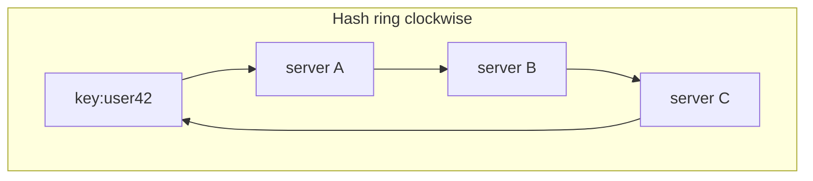
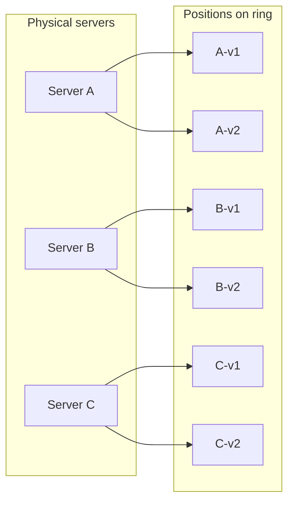

# Consistent Hashing

## The simple idea

You have many keys (cache entries, users, shards) and many servers. You need a rule:

> "Which server owns this key?"

**Consistent hashing** answers that in a way that barely reshuffles keys when servers join or leave.

Picture a clock face (a ring). Servers and keys are placed on the ring by hashing. A key belongs to the first server you meet walking clockwise.

## Why it matters

Naive mapping uses modulo:

```
server = hash(key) % N
```

That works until `N` changes. Add or remove one server -> almost **every** key moves. Caches go cold. Databases reshuffle huge amounts of data. Users feel pain.

Consistent hashing keeps most keys on the same server. Typically only about `1/N` of keys move when you add/remove one of `N` nodes.

You will use this idea for:

- Distributed caches (Memcached-style clusters)
- Database sharding / partition assignment
- Request routing to stateful workers
- Distributed hash tables and some load balancers

## How it works

### The hash ring

1. Choose a hash function that maps any string to a big integer space (e.g. 0 ... 2^32-1).
2. Treat that space as a **ring** (after the max value, wrap to 0).
3. Place each server on the ring: `hash(server_id)`.
4. Place each key on the ring: `hash(key)`.
5. Walk clockwise from the key until you hit a server - that server owns the key.



In practice the ring is just sorted hash positions in memory. Lookup = binary search for the next server clockwise.

### What goes wrong without virtual nodes

If each physical server has only one position on the ring, luck matters:

- One unlucky server might own a huge arc of the ring -> hot spot.
- Removing a neighbor dumps a large range onto one victim.

### Virtual nodes (vnodes)

Give each physical server **many** positions on the ring (virtual nodes), e.g. `A#1`, `A#2`, ... `A#100`.

Benefits:

- Ownership spreads more evenly.
- When a server dies, its load fans out to many survivors, not one neighbor.
- You can give stronger machines more vnodes.



### Rebalancing when nodes join or leave

**Server joins**

1. Place its vnodes on the ring.
2. Only keys that now fall into those new arcs move to the newcomer.
3. Everyone else stays put.

**Server leaves / fails**

1. Remove its vnodes.
2. Keys that pointed at it walk clockwise to the next live server.
3. Again, only that slice moves.

No global "rehash everything" storm.

### Replication on the ring

Often you store copies on the next `R` distinct physical servers clockwise. That way:

- Reads can tolerate failures.
- When a node dies, neighbors already have (or quickly receive) data.

Be careful: skip duplicate physical servers if multiple vnodes from the same machine appear in a row.

## Step by step / options

### Step-by-step mental algorithm

1. Hash all servers (or their vnodes) -> sorted ring list.
2. Hash the key.
3. Find the smallest ring point >= key hash (or wrap to the first point).
4. Map that vnode back to a physical server.
5. Optional: take the next `R-1` distinct physical servers for replicas.

### Compared to modulo hashing

| Topic | Modulo `hash % N` | Consistent hashing |
|-------|-------------------|--------------------|
| Add 1 server | ~all keys move | ~1/N keys move |
| Remove 1 server | ~all keys move | ~1/N keys move |
| Hot spots | Depends on hash | Needs vnodes to stay even |
| Implementation | Trivial | Ring + binary search |
| Best for | Fixed small N | Elastic clusters |

### Use cases in system design

**Caches**

- Client library maps `cache_key` -> cache node.
- Losing one node only invalidates its slice; the rest stay warm.

**Database shards**

- Partition users or tenant ids across shard servers.
- Expanding from 4 -> 5 shards moves roughly 20% of data, not 100%.

**Sticky sessions / stateful workers**

- Route a user to the same worker while that worker is alive.

### Practical details people forget

- **Hash quality matters.** A weak hash clusters keys; use a well-distributed hash.
- **Vnode count is a knob.** Too few -> imbalance. Too many -> bigger ring metadata.
- **Membership changes need coordination.** Gossip, config service, or cluster manager must agree on who is alive.
- **Lookups should be local.** Each client or proxy usually keeps a copy of the ring; they should not call a central "who owns this?" service per request.
- **Data movement is still work.** Consistent hashing reduces movement; it does not make migration free. Plan background transfer and throttling.

### Minimal example (toy numbers)

Ring space 0-99. Servers: A@10, B@40, C@70.

| Key hash | Owner (clockwise) |
|----------|-------------------|
| 5 | A (10) |
| 25 | B (40) |
| 55 | C (70) |
| 85 | A (10, wrap) |

Add D@60 -> only keys between 40 and 60 move from C to D. Keys at 55 move; keys at 85 stay on A.

## Key trade-offs

| Decision | Choice | Upside | Downside |
|----------|--------|--------|----------|
| Placement | Modulo | Dead simple | Massive reshuffle on change |
| Placement | Consistent hash | Stable ownership | Slightly more code |
| Vnodes | Few | Tiny metadata | Uneven load |
| Vnodes | Many | Smooth load, gentle failover | Larger ring maps |
| Replication | Next-N on ring | Simple locality | Neighbor hotspots if not careful |
| Ring owners | Clients hold ring | Fast lookups | Must update clients on membership |
| Ring owners | Proxy holds ring | Clients stay dumb | Proxy is critical path |

## Remember

- Modulo hashing breaks when cluster size changes; consistent hashing is built for **elastic** membership.
- A **ring + clockwise walk** is the core picture - draw it in interviews.
- **Virtual nodes** turn "lucky/unlucky arcs" into even load and safer failover.
- Expect about **1/N** key movement when membership changes by one node - not zero, but manageable.
- Pair the ring with **replication** and a clear **membership** story (how nodes discover joins/leaves).
- In interviews: problem (modulo reshuffle) -> ring -> vnodes -> join/leave behavior -> one real use case (cache or shards).
