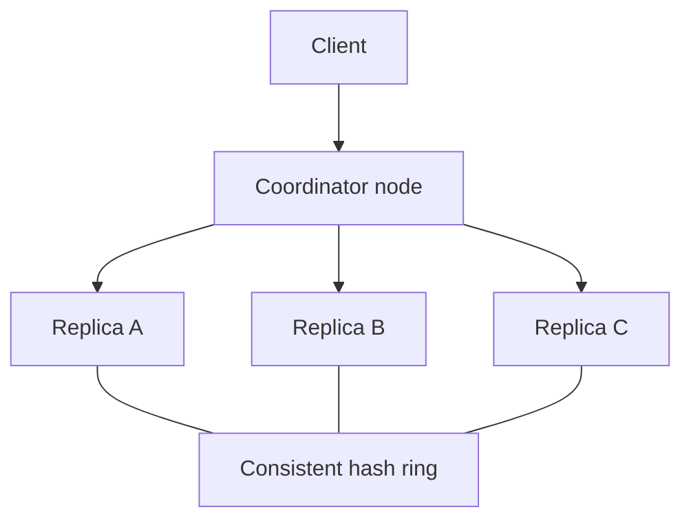
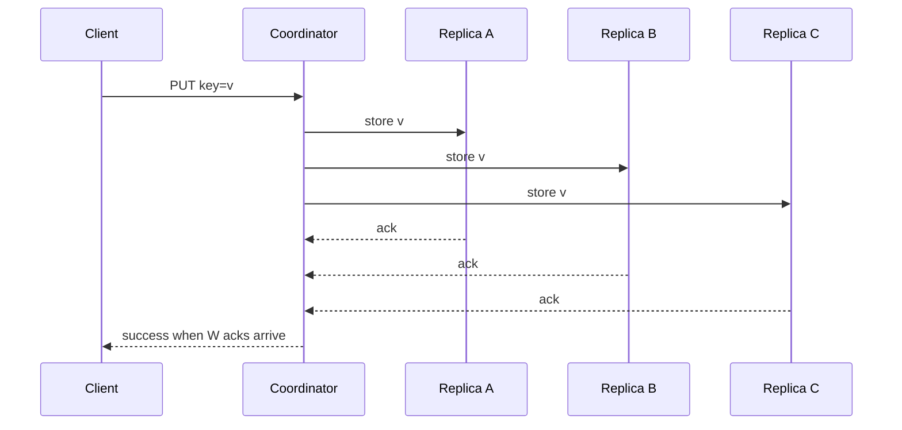

# Key-Value Store

## The simple idea

A **key-value store** is a giant dictionary:

```
PUT user:42 -> { name: "Ada", ... }
GET user:42 -> { name: "Ada", ... }
```

At small scale this is one database box. At large scale it is a **distributed system**: data is split across machines, copied for safety, and kept "close enough" to correct when networks fail.

This lesson walks a Dynamo-style design -- the pattern behind many production stores (and a classic interview favorite).

## Why it matters

Almost every big product has a hot path that looks like:

- Session store
- Feature flags / config by key
- Shopping cart
- User profile blob
- Feed pointer / timeline metadata

Relational databases are wonderful, but when you need **huge scale, simple access patterns, and tunable availability**, a partitioned key-value layer is often the right tool.

Interview signal: can you reason about **partitioning, replication, and consistency** without drowning in product jargon?

## How it works

### CAP in plain words

When a network split happens, you cannot have everything:

| Letter | Meaning in practice |
|--------|---------------------|
| **C** Consistency | Every read sees the latest successful write |
| **A** Availability | Every non-failing node still answers |
| **P** Partition tolerance | The system keeps working despite network splits |

In real distributed stores, **partitions happen**, so you choose a leaning:

- Prefer **availability + partition tolerance** -> maybe serve a slightly stale value rather than error.
- Prefer **consistency + partition tolerance** -> refuse some requests until quorums agree.

Dynamo-style KV stores usually lean toward **AP** with **tunable** consistency via quorums.

### Big pieces



1. **Partition** data with consistent hashing.
2. **Replicate** each key to `N` nodes.
3. Use **quorum** reads/writes (`R`, `W`) for stronger or weaker guarantees.
4. Repair divergence with **hinted handoff**, **gossip**, and **anti-entropy**.
5. Resolve conflicts with **vector clocks** or **last-write-wins**.

### Data partition

Place keys on a hash ring (see the Consistent Hashing lesson). Each key has a primary preference list of nodes.

Goals:

- Spread load evenly (virtual nodes help).
- Move little data when capacity changes.
- Keep replica sets predictable.

### Replication

For replication factor `N = 3`:

- Write lands on the coordinator.
- Coordinator forwards to the next `N` healthy nodes on the ring.
- Data survives some machine failures.



## Step by step / options

### Quorum: N, R, W

| Symbol | Meaning |
|--------|---------|
| `N` | Total replicas for a key |
| `W` | How many replicas must ack a write |
| `R` | How many replicas you query on read |

Rule of thumb:

- If `R + W > N`, reads and writes overlap on at least one up-to-date replica -> you get strong-ish consistency for that key (assuming no nasty failures).
- Example: `N=3, W=2, R=2`.

Tunings:

| Setting | Behavior | Use when |
|---------|----------|----------|
| `W=N, R=1` | Slow durable writes, fast reads | Write-rare, read-heavy |
| `W=1, R=N` | Fast writes, careful reads | Absorb spikes, verify on read |
| `W=2, R=2, N=3` | Balanced default | Many product stores |
| `W=1, R=1` | Very available, may read stale | Ephemeral / cache-like data |

### Write path (happy case)

1. Client sends `PUT` to any node (coordinator for this request).
2. Coordinator finds preference list via the ring.
3. Send write to `N` replicas.
4. When `W` acknowledge -> return success to client.
5. Remaining replicas catch up asynchronously if needed.

### Read path (happy case)

1. Client sends `GET`.
2. Coordinator asks `R` replicas.
3. If values match -> return.
4. If values disagree -> reconcile (see conflict resolution), return result, and optionally **read repair** the laggards.

### Hinted handoff

If a replica is temporarily down during a write:

- Another node can store a **hint**: "please give this write to node B later."
- When B returns, the hint holder forwards the data.

This improves availability for short outages. Hints are not forever -- pair them with deeper repair.

### Gossip

Nodes periodically whisper membership and ring state:

- "I am alive"
- "I think node X is unreachable"
- "Here is my view of the cluster"

Gossip spreads eventually without a single master config server (though many systems still use helpers). It keeps the ring view converging.

### Anti-entropy and Merkle trees

Hints fix short blips. For longer divergence, replicas run **anti-entropy**:

1. Compare what keys/versions each replica holds.
2. Copy missing or newer data.

**Merkle trees** speed the comparison:

- Leaf = hash of a key range's contents.
- Parents hash children.
- If top hashes match -> ranges match.
- If not -> drill down only into mismatched branches.

This avoids shipping entire datasets just to find a few gaps.

### Conflict resolution

Concurrent updates can create forks (especially with `W < N` or partitions).

**Last-write-wins (LWW)**

- Attach a timestamp.
- Newer timestamp wins; older is discarded.
- Simple, but clock skew can drop a valid write.

**Vector clocks**

- Each replica keeps a version counter vector.
- You can tell if one version **descends from** another, or if they are **concurrent**.
- Concurrent siblings may both be kept; the client (or app logic) merges (e.g. union of shopping-cart items).

High-level choice:

| Strategy | Pros | Cons |
|----------|------|------|
| LWW | Easy ops story | Silent data loss risk |
| Vector clocks + app merge | Safer for concurrent edits | More complex clients |
| CRDTs | Merge is automatic/mathy | Specialized data types |

### Temporary failures vs permanent ones

| Problem | First response | Deeper response |
|---------|----------------|-----------------|
| Node reboot | Hinted handoff | Read repair |
| Disk corruption | Restore from replicas | Anti-entropy |
| Network split | Quorum may reject or diverge | Conflict resolution after heal |
| Uneven load | Rebalance vnodes | Capacity planning |

### API surface to keep small

For interviews, stick to:

- `get(key)`
- `put(key, value)`
- optional `delete(key)`
- optional TTLs

Rich queries belong elsewhere (search index, SQL). The KV store wins by being boring and fast.

## Key trade-offs

| Topic | Option A | Option B | Notes |
|-------|----------|----------|-------|
| CAP lean | More available | More consistent | Quorum knobs move you along the spectrum |
| `W` high | Safer writes | Higher latency / more rejects | |
| `R` high | Fresher reads | More fan-out cost | |
| Conflict | LWW | Vector clocks | Simplicity vs correctness under concurrency |
| Repair | Hints only | Hints + Merkle anti-entropy | Need both for production |
| Coordinator | Client library | Any node as coordinator | Client needs ring awareness if smart |

## Remember

- A distributed KV store is **hash ring + replicas + repair**, not just a `Map`.
- **N/R/W** is how you explain consistency vs latency in one breath.
- **Hinted handoff** helps brief outages; **Merkle anti-entropy** heals longer drift.
- **Gossip** spreads membership; do not assume a perfect global view instantly.
- Conflicts are normal under availability-first designs -- pick **LWW** or **vector clocks** on purpose.
- In interviews: sketch ring -> set `N=3,R=2,W=2` -> narrate read/write paths -> mention repair and conflict strategy.
