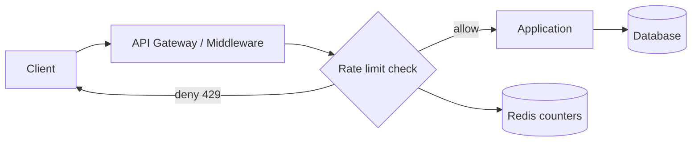
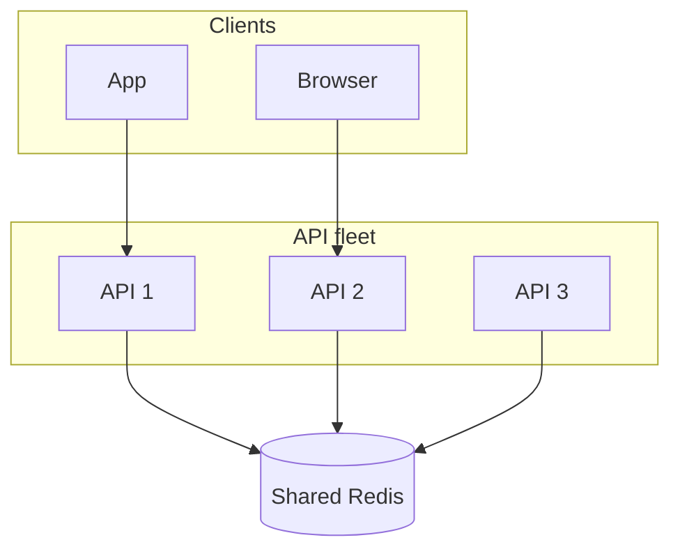

# Rate Limiter

## The simple idea

A **rate limiter** is a traffic gate. It answers one question for every request:

> "Has this client used up their allowance yet?"

If yes, you reject (or delay) the request. If no, you let it through and update the count.

Think of a coffee shop that serves at most 10 customers per minute. The 11th person waits or is asked to come back later. Your API needs the same kind of fairness.

## Why it matters

Without rate limits, a few noisy clients can:

- Overwhelm your servers and make everyone slow
- Burn through expensive downstream APIs (SMS, AI, payments)
- Amplify bugs (retry storms) into outages
- Abuse login, search, or scrape endpoints

In interviews and real systems, rate limiting shows up early because it is cheap protection with a huge reliability payoff.

Common goals:

| Goal | Example |
|------|---------|
| Fairness | 100 requests / minute / user |
| Cost control | Cap AI calls at 10 / hour / org |
| Abuse defense | Limit failed logins per IP |
| Smooth load | Stop sudden spikes from crashing a dependency |

## How it works

### High-level design

Most production designs look like this:

1. Request hits an API gateway or middleware.
2. Middleware builds a key (user id, API key, IP, route).
3. It checks/updates counters in a fast store (often Redis).
4. Allowed -> continue. Denied -> `429 Too Many Requests` (+ retry headers).



Rules can live in config, a database, or a rules service. Hot path should stay in memory/Redis so each check is a few milliseconds.

### Distributed rate limiting

One server with an in-memory counter fails when you have many replicas: each replica has its own count, so limits become "N x limit".

Shared state (Redis, or a dedicated limiter service) keeps one truth across instances.



## Step by step / options

### 1. Token bucket

Imagine a bucket that slowly fills with tokens.

- Each request costs 1 token.
- If the bucket has a token -> allow and remove one.
- Tokens refill at a fixed rate (e.g. 10/sec).
- Bucket has a max size (burst capacity).

**Good for:** allowing short bursts, then enforcing a steady average.

**Intuition:** You can drink a few sips quickly, then wait for the bottle to refill.

### 2. Leaking bucket

Requests enter a queue (the bucket). The system processes them at a fixed drain rate.

- If the queue is full -> reject.
- Output is smooth; spikes get absorbed or dropped.

**Good for:** protecting a fragile downstream that cannot handle bursts.

**Difference from token bucket:** leaking bucket shapes traffic into a steady stream; token bucket allows bursts up to capacity.

### 3. Fixed window counter

Pick a window (e.g. "this minute"). Count requests. Reset at the window boundary.

```
Window 12:00-12:01 -> count = 87 / 100
Window 12:01-12:02 -> count resets to 0
```

**Pros:** simple, cheap, easy in Redis (`INCR` + `EXPIRE`).

**Cons:** boundary burst. A client can send 100 at 12:00:59 and 100 at 12:01:00 -> 200 in two seconds while still "within limit".

### 4. Sliding window log

Store a timestamp for every request. On a new request, drop timestamps older than the window, then count what remains.

**Pros:** accurate.

**Cons:** memory heavy for high-volume keys (one timestamp per request).

### 5. Sliding window counter

A practical middle ground:

- Keep counts for the current window and the previous window.
- Estimate usage with a weighted blend based on how far you are into the current window.

Example: window = 60s, we are 30s into the new window -> weight previous window by 50%.

**Pros:** much smoother than fixed window, cheaper than full log.

**Cons:** approximate (usually good enough).

### Algorithm cheat sheet

| Algorithm | Burst friendly? | Accuracy | Cost | Typical use |
|-----------|-----------------|----------|------|-------------|
| Token bucket | Yes (by design) | High | Low-medium | APIs, public gateways |
| Leaking bucket | No (smooths) | High | Medium | Protect slow workers |
| Fixed window | Boundary spikes | Medium | Very low | Simple quotas |
| Sliding log | Controlled | Highest | High | Strict security limits |
| Sliding counter | Mostly smooth | High (approx) | Low | Large-scale APIs |

### Implementing the check (mental model)

1. Identify the subject: `user:42`, `ip:1.2.3.4`, `apiKey:abc`.
2. Identify the rule: `POST /search` -> 30/min.
3. Build Redis key: `rl:search:user:42`.
4. Run algorithm atomically (Lua script or Redis transaction).
5. Return allow/deny + remaining quota + reset time.

Response tips when denying:

- Status: `429`
- Headers: `Retry-After`, `X-RateLimit-Limit`, `X-RateLimit-Remaining`

### Rules storage

Keep two layers:

| Layer | What lives there | Why |
|-------|------------------|-----|
| Hot config / cache | Active limits per route/plan | Fast reads on every request |
| Source of truth | DB or config service | Editing plans, enterprise overrides |

Reload rules periodically or push updates. Never hit a slow DB on every request just to learn "what is the limit?"

### Bypass and allowlist

Real systems need escape hatches:

- **Allowlist:** internal health checks, partner IPs, admin tools
- **Higher tiers:** paid plans get bigger buckets
- **Emergency bypass:** kill-switch when the limiter itself is unhealthy (fail open vs fail closed -- choose deliberately)

Fail **closed** (deny) for auth/abuse endpoints. Fail **open** (allow) may be safer for read-only public content if availability matters more than perfect enforcement -- document the choice.

### Soft vs hard limits

- **Hard:** reject immediately.
- **Soft:** allow but mark, throttle latency, or alert ops.

Many products warn at 80%, then hard-block at 100%.

## Key trade-offs

| Decision | Option A | Option B | Pick when... |
|----------|----------|----------|------------|
| Where to limit | Edge / gateway | App middleware | Edge for global protection; app for business rules |
| State store | Local memory | Redis | Local only if single instance; Redis for fleets |
| Algorithm | Fixed window | Token / sliding | Fixed for simplicity; others for fairness |
| On Redis outage | Fail open | Fail closed | Availability vs abuse risk |
| Key granularity | Per IP | Per user / route | IP is coarse; user+route is fairer |
| Sync precision | Approximate | Exact log | Approx scales; exact costs memory |

## Remember

- Rate limiting is a **gate**, not a full security system -- combine with auth, WAF, and quotas.
- Prefer **shared counters** once you have more than one server.
- **Token bucket** and **sliding window counter** are the workhorses of modern APIs.
- Always return clear **429 + retry guidance** so honest clients can back off.
- Design **allowlists and failure mode** before the first incident, not during it.
- In interviews: state the key (`user`/`IP`), pick an algorithm with a trade-off, place Redis next to the gateway, and mention distributed consistency of counts.
