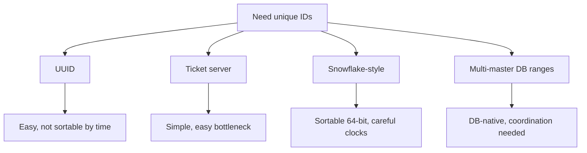
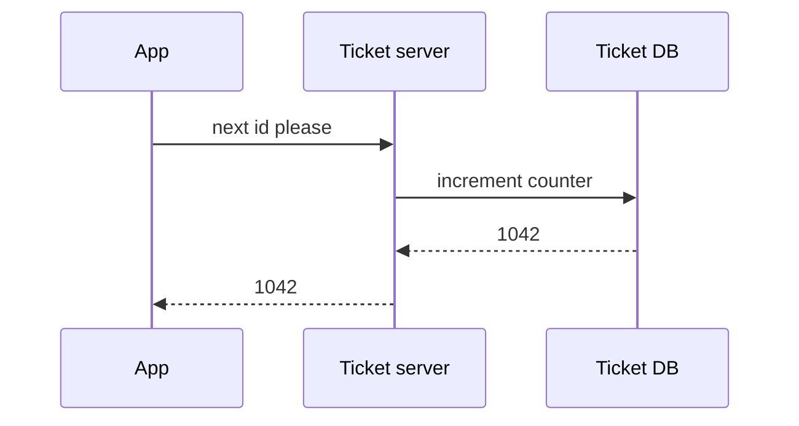
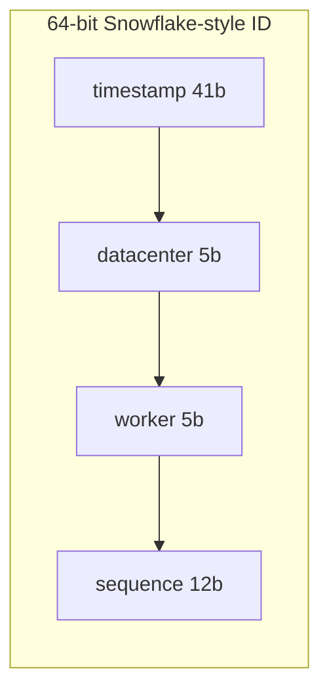

# Unique ID Generator

## The simple idea

Many systems need an ID for every new row, event, or object:

> "Give me a new id that nobody else will also get."

At one database, `AUTO_INCREMENT` is enough. At global scale -- many servers, many regions -- you need a **distributed unique ID generator**.

Bonus wishes (often required in interviews):

- IDs are **unique**
- IDs are roughly **time-sortable**
- Generation stays **fast** (millions per second cluster-wide)
- Service keeps working if some machines die

## Why it matters

IDs show up everywhere:

- Tweet / post ids
- Order numbers
- Distributed tracing spans
- Shard keys and event logs
- Idempotency keys for payments

Bad ID designs cause:

- Collisions (two orders, one id -- nightmare)
- Hot database shards (everyone writing sequential ids to one page)
- Painful sorting ("show newest first" needs extra timestamps)
- Cross-region bottlenecks (one global ticket booth)

## How it works

### Requirements checklist

| Requirement | Why |
|-------------|-----|
| Unique | No two objects share an id |
| High throughput | Spikes should not stall creates |
| Low latency | Creating an object should not wait on a far-away lock |
| Sortable (nice) | `ORDER BY id` ~ chronological |
| Compact (nice) | 64-bit fits indexes and URLs better than long strings |
| Operable | Clear story for multi-datacenter and clock issues |

### Option map



## Step by step / options

### 1. UUID (v4)

A random 128-bit value (string like `550e8400-e29b-41d4-a716-446655440000`).

**Pros**

- No coordination between servers
- Easy libraries everywhere
- Extremely unlikely collisions

**Cons**

- Not time-ordered (v4)
- 128-bit / verbose in indexes and logs
- Random inserts can fragment B-trees (depends on DB)

**Use when:** simplicity wins and you do not need sortable ids.

(UUIDv7 improves time-ordering -- mention it if you want a modern aside.)

### 2. Ticket server (Flickr-style)

One (or a few) database tables hand out integers:

```sql
UPDATE tickets SET id = id + 1;
SELECT id FROM tickets;
```

Or allocate batches: "give me the next 1000 ids."

**Pros**

- Numeric, sortable, tiny
- Easy to understand

**Cons**

- Central component can become a **single point of failure / bottleneck**
- Multi-region latency if everyone talks to one ticket booth
- Must carefully high-available the ticket DB

**Mitigation:** two ticket servers with odd/even ranges (A issues 1,3,5... B issues 2,4,6...) -- uniqueness holds, but gaps appear and ops complexity rises.



### 3. Snowflake-style IDs

Compose a **64-bit** integer from time and machine fields so many workers mint ids independently.

Classic layout (Twitter Snowflake inspired -- exact bit counts vary by company):

```
0 1                                42 43        52 53      62 63
+-+----------------------------------+----------+----------+----+
|0|          timestamp (ms)          | datacenter|  worker  |seq |
+-+----------------------------------+----------+----------+----+
```

Example bit budget (41 + 5 + 5 + 12 = 63, plus 1 unused sign bit):

| Field | Bits | Role |
|-------|------|------|
| Sign / unused | 1 | Keep id positive as signed int64 |
| Timestamp | 41 | Milliseconds since a custom epoch |
| Datacenter id | 5 | Up to 32 datacenters |
| Worker id | 5 | Up to 32 workers per DC |
| Sequence | 12 | Up to 4096 ids per ms per worker |



**How a worker mints an id**

1. Read current time in ms since epoch.
2. If same ms as last id -> bump sequence.
3. If sequence overflows -> wait for next ms.
4. Pack fields into one integer.

**Pros**

- No chatty central ticket server on the hot path
- Roughly time-sortable
- Compact 64-bit
- Very high throughput per worker

**Cons / risks**

- **Clock skew:** if the clock jumps backward, you might reuse a (timestamp, sequence) pair -> collision risk
- Worker id assignment must be unique (config, ZooKeeper/etcd lease, etc.)
- IDs reveal timing and rough machine identity (sometimes a privacy/ops concern)

### 4. Multi-master database ranges

Each DB region or shard pre-allocates a range:

- Region A: `1_000_000_000 ... 1_999_999_999`
- Region B: `2_000_000_000 ... 2_999_999_999`

Or each node grabs a lease block (`AUTO_INCREMENT` with increment step, or a sequence table with big chunks).

**Pros**

- Fits naturally with relational systems
- Low runtime coordination after ranges are granted

**Cons**

- Ranges can run out unevenly
- Not always globally time-sortable across regions
- Needs solid allocation / monitoring

### Clock skew issues (take this seriously)

Distributed ID schemes that embed time fail in subtle ways when NTP steps the clock:

| Event | Danger | Defense |
|-------|--------|---------|
| Clock moves backward | Duplicate timestamp+seq | Refuse to mint / wait until time > last used |
| Clock jumps forward | Future-dated ids; later rewind hurts | Cap acceptable jump; alert |
| Two workers share worker id | Collisions | Strong worker-id lease |
| VM pause / freeze | Time looks stuck then jumps | Monotonic clock + last-timestamp store |

Practical pattern: persist `last_timestamp` and `last_sequence` in memory (and optionally disk) per worker; never emit an id that is not strictly advancing for that worker.

### Choosing in an interview

1. Clarify: sortable? 64-bit? multi-region?
2. Offer 2-3 options with trade-offs.
3. Go deep on one (usually Snowflake-style) -- draw the bit layout.
4. Mention failure modes: ticket SPOF, UUID index churn, clock skew.

## Key trade-offs

| Approach | Unique? | Sortable? | Throughput | Main risk |
|----------|---------|-----------|------------|-----------|
| UUID v4 | Yes | No | Excellent | Bigger keys, random index writes |
| Ticket server | Yes | Yes | Limited by booth | Hot spot / availability |
| Snowflake-style | Yes | Mostly by time | Excellent | Clocks + worker ids |
| Multi-master ranges | Yes | Per-range only | Excellent | Range exhaustion / imbalance |

| Design knob | Tighter | Looser |
|-------------|---------|--------|
| Sequence bits | Fewer ids/ms | More burst capacity |
| Timestamp bits | Shorter lifetime | Longer epoch lifespan |
| Worker bits | Fewer machines | More horizontal scale |

## Remember

- Start from requirements: **unique**, then **sortable**, then **throughput**.
- **UUID** is the easiest path; **Snowflake** is the interview workhorse for sortable 64-bit ids.
- **Ticket servers** are clear but centralize risk -- batching and odd/even pairs help a bit.
- Draw the **bit layout** when you propose Snowflake; it shows you understand independence across workers.
- Always discuss **clock skew** and **unique worker ids** -- that is where real collisions come from.
- Gaps in ID sequences are normal and fine; do not chase gapless numbers at global scale.
