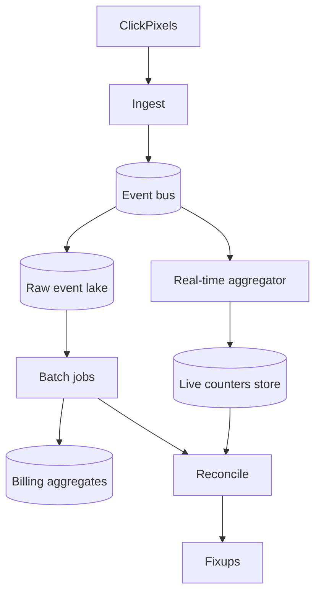

# Ad Click Event Aggregation

## The simple idea

Ads generate a firehose of click (and impression) events. Business teams want near-real-time counters--"how is this campaign doing right now?"--while finance needs accurate totals for billing. The system ingests the stream, dedupes fraud/noise, aggregates in windows, and later reconciles real-time numbers with a slower, careful batch truth.

## Why it matters

Clicks equal money. Double-counting overcharges advertisers; undercounting loses revenue. Real-time dashboards and billing ledgers have different tolerances for delay and error. You design two speeds that eventually agree.

## Clarify

- **Events**: clicks only, or impressions + conversions too?
- **Dedupe rules**: same click ID? same user+ad in N seconds?
- **Latency target**: dashboard within seconds? minutes?
- **Billing SLA**: daily settlement? hourly?
- **Fraud**: bot filters in-scope or separate system?
- **Dimensions**: campaign, ad, publisher, country, device?

Default: click stream with idempotent event IDs, real-time approx aggregates, batch reconciliation for billing.

## High-level design



1. Edge pixels / SDKs emit click events to ingest.
2. Events land on a durable bus and are archived raw.
3. Stream jobs maintain live windows for dashboards.
4. Batch jobs recompute from raw for billing-grade totals.
5. Reconciliation compares live vs batch and corrects drift.

## Deep dive

### Click stream

Event sketch:

```text
click_id, user_cookie_or_id, campaign_id, ad_id,
publisher_id, ts, ip_hash, user_agent, redirect_url
```

Ingest responsibilities:

- Validate schema and auth of the pixel endpoint.
- Assign or accept a globally unique `click_id`.
- Publish to the bus with enough partitions for key parallelism (e.g. by `campaign_id`).
- Acknowledge quickly; never do heavy fraud ML on the request path.

Keep **raw events immutable** in cheap object storage for replay.

### Dedupe

Duplicates happen: retries, double taps, malicious replays, flaky redirects.

Layers:

1. **Exact**: drop duplicate `click_id` (idempotent key in a cache/DB with TTL >= max retry window).
2. **Near-duplicate heuristics**: same user + ad within a few seconds (product-specific).
3. **Fraud / quality**: bot scores, denylists--often async, tagging events rather than hard-dropping on ingest.

For money paths, prefer "mark invalid" over silent delete so audits can explain gaps.

### Real-time vs batch

| Path | Goal | Tolerance |
| --- | --- | --- |
| Real-time | Ops dashboards, pacing, anomaly alarms | Small error / lag OK |
| Batch | Billing, invoices, legal reports | Correctness first |

Real-time uses streaming aggregations (Flink/Spark Streaming/Kafka Streams style). Batch recomputes from the lake with fuller dedupe and late-data handling.

Never bill solely off an in-memory counter you cannot rebuild.

### Aggregation windows

Common windows:

- **Tumbling** 1-minute buckets for dashboards.
- **Hopping/sliding** for smoother short-term rates.
- **Session** windows rarely needed for clicks; prefer fixed billing periods (hour/day) in batch.

Dimensions explode storage--pre-aggregate common rollups (campaign x minute) and compute rare breakdowns offline.

Late events: allow a watermark (e.g. 15 minutes). After close, either update the bucket (if mutable) or let batch fix it.

### Reconciliation

On a schedule:

1. Sum real-time counters for period P.
2. Compute batch truth for P from raw events with final dedupe rules.
3. Diff by campaign (and totals).
4. If drift > threshold, alert and apply billing from batch; optionally backfill dashboards.
5. Record reconciliation reports for finance audit.

Expect small drift from late arrivals and heuristic filters. Large drift means a bug--page the on-call.

## Key trade-offs

| Choice | Upside | Downside |
| --- | --- | --- |
| Real-time only | Fast & simple | Billing risk |
| Batch only | Accurate | Slow feedback for ops |
| Dual path + reconcile | Best of both | Two systems to operate |
| Strict exact dedupe | Clean money math | Needs reliable click IDs |
| Aggressive fraud drops | Less waste | False positives hurt publishers |

## Remember

- Treat clicks as a **durable stream + immutable raw lake**.
- Dedupe with idempotent `click_id`s; add heuristics carefully.
- Real-time for dashboards; batch for money; **reconcile** them.
- Window aggregates by product needs; plan for late events.
- Dimension cardinality in rollups can be as dangerous as metric cardinality--cap what you materialize live.
