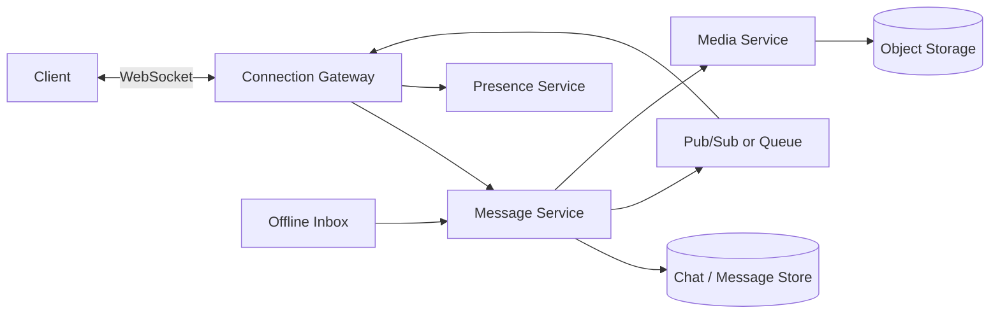
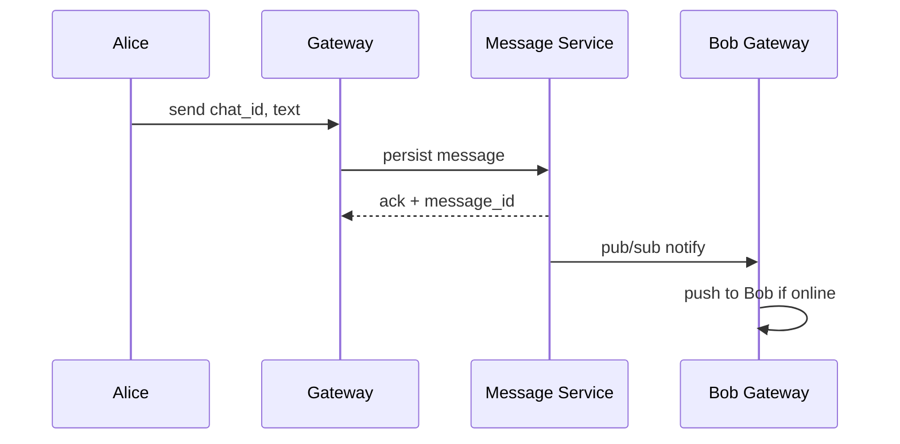

# Chat System

## The simple idea

A chat system delivers messages between people in near real time. Users expect typing indicators, online status, group chats, and messages waiting for them when they reconnect.

## Why it matters

Chat combines **low-latency delivery**, **persistent history**, and **presence** -- three different workloads glued into one product. Interviewers use it to explore connections, fan-out, and offline handling.

## Clarify (requirements + rough numbers)

- **Scopes:** 1:1 chat, group chat (how large?), message history, media, read receipts?
- **Delivery:** at-least-once is fine if clients de-dupe by message id.
- **Latency:** soft real time -- hundreds of ms is usually OK; not stock-trading speed.
- **Scale sketch:** 50M DAU, average 40 messages/user/day -> ~20k msg/sec average, much higher peaks. Concurrent online users might be 10-20% of DAU.
- **Consistency:** messages in a conversation should appear in a sensible order (sequence numbers or Lamport-ish timestamps per chat).

## High-level design

Gateways hold sockets; the message service owns persistence and routing.

## Deep dive

### 1. WebSocket vs long polling

| Approach | How it works | Pros | Cons |
| --- | --- | --- | --- |
| **WebSocket** | Persistent bidirectional socket | Low latency, server can push | More connection state to manage |
| **Long poll** | Client holds HTTP request until event or timeout | Works through simple proxies | Higher overhead, more reconnect churn |

Prefer **WebSockets** (or SSE + POST for send-only) for modern chat. Mention long poll as a fallback for constrained networks. Gateways are horizontally scaled; each holds a map of `user_id -> connection`.

When a message must reach a user connected to another gateway, use **pub/sub** (Redis, Kafka, NATS) keyed by user or chat id.

### 2. 1:1 vs group messaging

**1:1:** small fan-out. Persist message, push to the other participant (and any of the sender's other devices).

**Group:** fan-out grows with member count.

- Small groups (<=100): message service can push to each online member via pub/sub.
- Very large groups / channels: treat more like a feed -- members pull recent messages; only online subscribers get pushes.

Assign each message a **monotonically increasing sequence** per `chat_id` so clients can sort and detect gaps.

### 3. Message service, presence, and offline inbox

**Message service responsibilities:**

- Validate membership.
- Persist to durable storage (wide-column or sharded SQL by `chat_id`).
- Emit delivery events.
- Serve history pages (`cursor` / sequence based).

**Presence:** heartbeats over the socket update `online` / `last_seen` in a fast store with short TTL. Broadcast presence only to relevant friends/chats -- global floods do not scale.

**Offline inbox:** if the recipient has no active connection, leave the message in storage (it already is) and optionally a per-user "unread / pending push" queue. On reconnect, client syncs: "give me everything after sequence N" plus pending push notifications via APNs/FCM for mobile.

### 4. Media

Do not send images through the chat socket as huge payloads.

1. Client requests an upload URL from a media service.
2. Client uploads directly to object storage.
3. Client sends a chat message containing the media id / CDN URL.
4. Recipients download via CDN.

Virus scan and thumbnail generation can happen asynchronously after upload.

For multi-device users, fan the same message to every active session for that user, and keep device-level read cursors if you need accurate unread badges.

## Key trade-offs

- **WebSocket vs long poll:** efficiency vs operational simplicity in hostile networks.
- **Push all group members vs pull channels:** freshness vs fan-out cost.
- **Strong ordering vs availability:** per-chat sequences are usually enough; global ordering is not required.
- **Store full history forever vs tiered retention:** cost vs product expectations.

## Remember

- Gateways manage connections; message service manages truth.
- Use WebSockets + pub/sub for cross-server delivery.
- Sequence messages per chat; sync gaps on reconnect.
- Presence is ephemeral -- heartbeat + TTL.
- Media goes to object storage; chat carries pointers.
