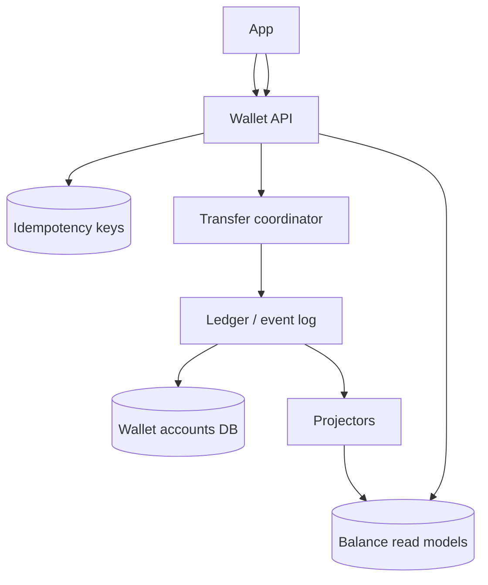
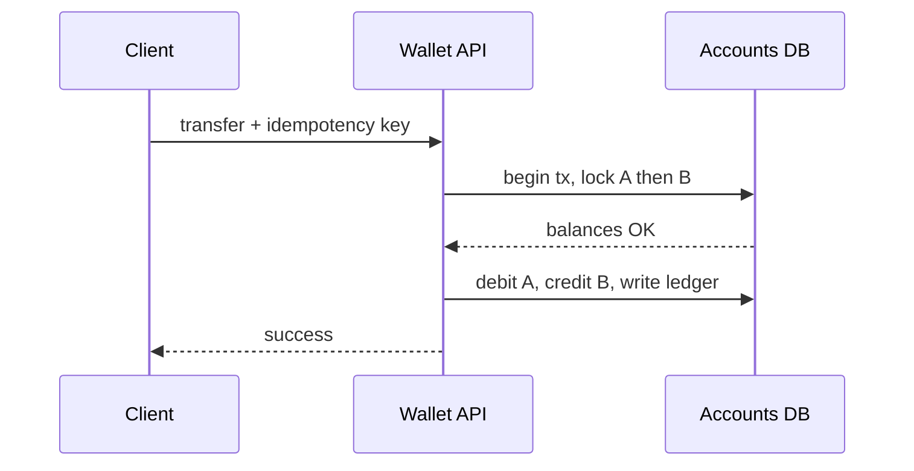
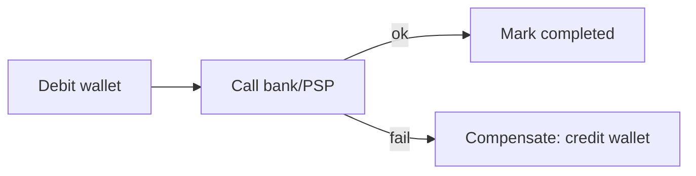

# Digital Wallet

## The simple idea

A digital wallet holds balances and moves value between accounts: top-up, pay, transfer, withdraw. The hard part is **concurrency** -- two transfers must not spend the same money twice. For complex multi-step flows, use careful orchestration (sagas) instead of giant distributed locks.

## Why it matters

Wallets sit next to payments, gaming coins, and fintech apps. Users forgive slow UIs; they do not forgive vanishing balances. Interviews test whether you protect money under retries and race conditions.

## Clarify

- Single currency or multi-currency / multi-asset?
- Only internal transfers, or also bank rails / PSP cash-out?
- Strong real-time balance vs eventual for some reads?
- Limits, freezes, KYC holds, merchant escrow?
- Audit requirements: every change explainable years later?

APIs:

- `POST /wallets/{id}/transfer` -- `{ toWalletId, amount, idempotencyKey }`
- `GET /wallets/{id}/balance`
- `GET /wallets/{id}/ledger?cursor=`
- `POST /wallets/{id}/hold` / `capture` / `release` (optional authorization pattern)

## High-level design

## Deep dive

### Balance transfers

A transfer is atomic from the product view: debit A, credit B, same amount, or neither.

Simple single-database approach:

1. Take idempotency key; return prior result if seen.
2. Lock accounts in a **stable order** (e.g. sort by wallet id) to avoid deadlocks.
3. Check available balance (balance - holds).
4. Append ledger entries + update balances in one transaction.
5. Commit; emit "transfer completed" for notifications.

### Concurrency

Common failure: two requests read balance 100 and both spend 80.

Defenses:

- **Row locks / serializable transactions** on the account rows
- **Optimistic versioning**: `UPDATE ... WHERE version = ?` and retry on conflict
- **Holds (reservations)**: authorize 80 now, capture later so the balance cannot be double-spent

Available balance = posted balance - open holds.

### Event sourcing / CQRS in plain words

**Event sourcing**: do not only store "balance = 42." Store the story: `Credited 50`, `Debited 8`, ... Balance is what you get by replaying (or by maintaining a fold of those events).

**CQRS**: split **commands** (transfer, hold) from **queries** (show balance, list activity). Commands write the ledger/events; projectors build fast read tables.

Why wallets like this:

- Perfect audit trail
- Easy to rebuild read models after bugs
- Natural fit for "exactly what happened" disputes

Cost: more moving parts; you must handle eventual read lag or read-your-writes carefully after a transfer.

### When one database is not enough: saga vs 2PC

If wallets, promotions, and bank payouts live in different services, a single ACID transaction may be impossible.

**Two-phase commit (2PC)** -- ask all services to prepare, then commit. Simple mentally, painful in practice (locks, coordinator failures). Rare across modern microservices.

**Saga** -- a sequence of local transactions with **compensations**:

1. Debit wallet (local commit)
2. Call payout service
3. If payout fails -> credit wallet back (compensate) and mark transfer failed

Use sagas for multi-step money movement across systems; keep **single-wallet bookkeeping** as strongly consistent as you can.

## Key trade-offs

| Choice | Upside | Downside |
| --- | --- | --- |
| Single DB ACID transfer | Correct and simple | Scale ceiling |
| Optimistic concurrency | Good throughput | Retry logic in clients/workers |
| Event sourcing | Audit + rebuild | Operational complexity |
| Strongly consistent reads | Trustworthy UI | Less scale headroom |
| Saga across services | Works distributed | Temporary inconsistency, careful comps |

## Remember

- Serialize spend on an account; idempotency keys on every transfer.
- Ledgers (or events) explain balances; plain mutable integers alone will haunt you.
- Prefer local ACID for core bookkeeping; use sagas when multiple systems must move together.
