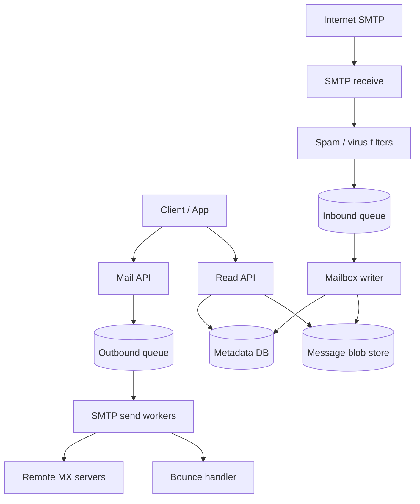

# Distributed Email Service

## The simple idea

Email is two jobs: **send** messages to other domains, and **receive** messages into mailboxes. Treat SMTP like a slow, unreliable network API. Put work on queues, store mail safely, and retry when delivery fails.

## Why it matters

Everyone expects email to "just work," but SMTP is old, lossy, and full of spam. A good design keeps inbox reads fast while send/receive stay durable under spikes and bad remote servers.

## Clarify

Ask before you draw boxes:

- Send only, receive only, or both (full MTA + mailbox)?
- Scale: messages/day, peak QPS, average size, attachment limits?
- Latency: is "accepted for send" enough, or must remote delivery finish in the request?
- Storage: how long to keep mail, drafts, and deleted items?
- Spam and abuse: user reports, blocklists, rate limits per sender?
- Bounce handling: soft vs hard bounces, unsubscribe, complaint feedback?

APIs (sketch):

- `POST /send` -- enqueue outbound mail
- `GET /mailbox/{id}/messages` -- list inbox
- `GET /messages/{id}` -- fetch body + metadata
- SMTP inbound on ports 25/587 (receive / submission)

## High-level design

## Deep dive

### Send path

1. API authenticates the user, validates recipients and size, then writes a **durable outbound job** (queue or outbox table).
2. Reply quickly with "accepted" and a message id. Do not hold the HTTP request open while talking to remote MX hosts.
3. Send workers pull jobs, look up MX records, open SMTP, and deliver.
4. On success, mark delivered. On failure, classify and retry or bounce.

Keep the queue **at-least-once**. Idempotency keys (user id + client message id) stop duplicate sends when the client retries.

### Receive path

1. SMTP receive service accepts connections, checks DNS/HELO/basic policy, then accepts the DATA payload.
2. Run spam and malware checks **before** the message becomes visible in the inbox (or quarantine first).
3. Enqueue a write job: store the raw MIME blob once, then insert searchable metadata (from, to, subject, date, folder, flags).
4. Notify the user's devices (optional push) that new mail arrived.

### Mailbox storage

Split **metadata** and **blobs**:

| Piece | What it holds | Why |
| --- | --- | --- |
| Metadata DB | folder, flags, thread id, pointers | Fast list/search |
| Blob store | raw MIME / attachments | Cheap large objects |
| Index (optional) | full-text on subject/body | Search at scale |

Shard mailboxes by user id so one hot inbox does not overload everyone else. Soft-delete to a Trash folder; hard-delete later with lifecycle rules.

### Queues and retries

Outbound delivery fails often (graylisting, busy servers, DNS blips). Use:

- **Exponential backoff** with jitter for soft failures
- A **dead-letter / bounce** path after N tries or on hard failures (unknown user, rejected domain)
- Separate queues for priority mail vs bulk newsletters so marketing spikes do not starve transactional mail

### Spam, bounces, and reputation

Spam filters score inbound mail (content, sender history, authentication like SPF/DKIM/DMARC at a high level). Outbound reputation matters too: if you blast spam, remote providers block you.

**Hard bounce** -> stop sending to that address; mark invalid.  
**Soft bounce** -> retry with backoff.  
**Complaint / feedback loop** -> treat like a hard stop for that recipient and reduce sending rate.

Keep a per-domain and per-user send budget. When remote servers return "try later," slow that lane without freezing the whole fleet.

### Read path and search

Inbox list queries should hit metadata only: folder + flags + date, never scan raw MIME. Open-message fetches the blob (and may cache hot bodies briefly). Full-text search is optional -- feed an indexer asynchronously from the inbound queue so receive latency stays predictable.

## Key trade-offs

| Choice | Upside | Downside |
| --- | --- | --- |
| Sync SMTP in API request | Simple demo | Timeouts, poor UX under load |
| Async queue + workers | Durable, scalable | Need status tracking |
| Metadata + blob split | Cheap scale | More moving parts |
| Aggressive spam drop | Cleaner inboxes | False positives |
| Aggressive retries | Higher delivery | Can look like abuse |

## Remember

- Accept fast, deliver asynchronously, store blobs once and metadata separately.
- Retries need backoff and clear hard-bounce rules.
- Spam and sender reputation are first-class design concerns, not add-ons.
