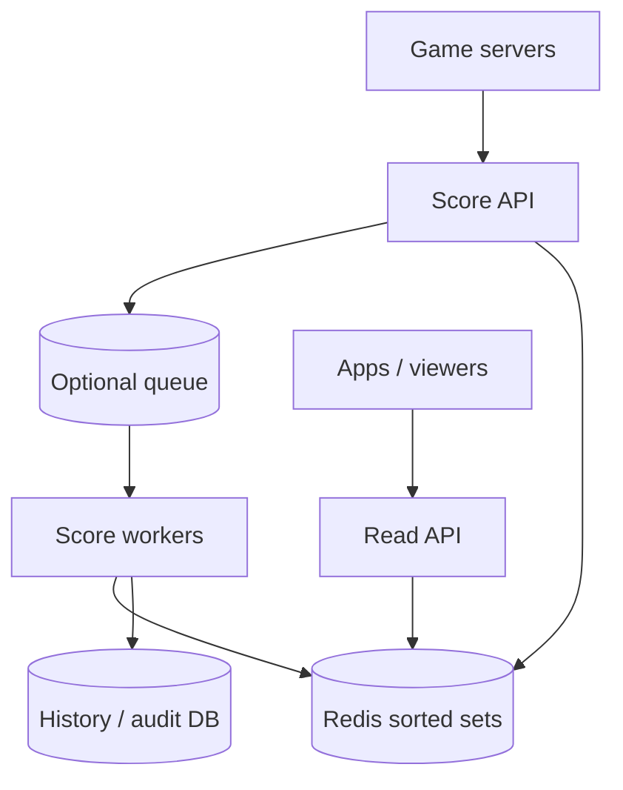
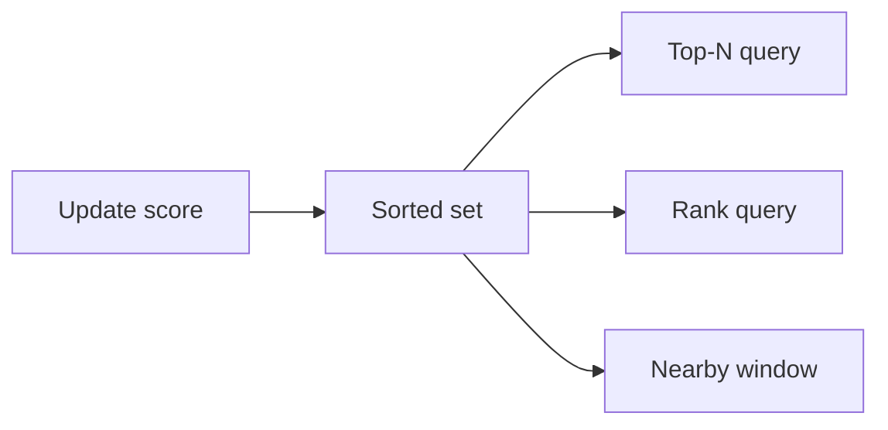

# Real-time Gaming Leaderboard

## The simple idea

Players submit scores. The system keeps a live ranking so you can show **top-N** and a player's **relative rank** quickly. A Redis **sorted set** (score → member) is a natural fit; shard by game or season when one board gets too hot.

## Why it matters

Leaderboards look simple until millions of players update scores every second. You need fast writes, fast top lists, and fair ranking without scanning every player row in a database.

## Clarify

- One global board or many (per game mode, region, season)?
- Update rate and read rate (viewers vs players)?
- Ranking rules: higher better? ties by time? only best score counts?
- How fresh must the board be (100 ms vs a few seconds)?
- Do you need "players near me" (±10 ranks) as well as top-100?

APIs:

- `POST /games/{id}/scores` — `{ playerId, score }`
- `GET /games/{id}/top?n=100`
- `GET /games/{id}/rank/{playerId}` — rank + nearby window

## High-level design

## Deep dive

### Score updates

On each score event:

1. Validate player and game session (anti-cheat is its own deep topic — at least auth + rate limits).
2. Decide the stored score: latest, max, or cumulative depending on game rules.
3. Update the sorted set: `ZADD leaderboard:{game}:{season} score playerId`.
4. Optionally write an immutable event to a database for audits and rebuilds.

If the game can send duplicates, make updates **idempotent** (event id) or use "only increase" logic when that matches the rules.

### Top-N with sorted sets

Redis sorted sets keep members ordered by score. Top-100 is roughly `ZREVRANGE key 0 99 WITHSCORES` — O(log N + M), which stays fast even for large N.

### Relative rank

- Absolute rank: `ZREVRANK` (or `ZRANK`) for the player.
- Score: `ZSCORE`.
- Nearby: fetch a window around that rank so the UI can show "you vs local rivals."

Cache the player's last known rank briefly if read traffic explodes after a tournament ends — but keep writes authoritative in Redis (or your ranking store).

### Sharding by game / season

Do **not** put every game on one giant key forever.

| Shard key | Why |
| --- | --- |
| `gameId` | Natural isolation; easy ops |
| `seasonId` / week | Old seasons go cold; archive later |
| region | Fair local competition + lower latency |

Each shard is its own sorted set (or small set of sets). Cross-shard global merges are rare — prefer product rules that avoid them (separate boards).

When a season ends: snapshot top-N to durable storage, serve history from DB/object storage, and expire the hot Redis key.

### When Redis is not enough

- Extremely large N with complex tie-breaks → keep Redis for hot top lists and a secondary index for deep ranks.
- Multiplayer fairness / anti-cheat → validate on trusted game servers before the board sees the score.
- Global "all-time" boards → pre-aggregate into fewer keys; do not merge thousands of sets on every read.

### Ties and display rules

Decide tie-breaks up front: earlier timestamp wins, or players share a rank with gaps ("1, 2, 2, 4"). Sorted sets alone order by score then member name — if you need time-based ties, encode a composite score (e.g. score bits + inverted time) or store tie metadata beside the set.

For the UI, return `{ rank, score, nearby[] }` in one call so the client does not hammer the API with N+1 rank lookups.

## Key trade-offs

| Choice | Upside | Downside |
| --- | --- | --- |
| Sync write to Redis in API | Simple, very fresh | Spikes hit Redis hard |
| Queue + async apply | Smooth load | Slightly stale ranks |
| One key per game/season | Clear sharding | Many keys to manage |
| Only top-N materialized | Cheap | Deep rank slower |
| Exact rank always | Great UX | More load on the store |

## Remember

- Sorted sets give you top-N and rank without scanning everyone.
- Shard by game and season before the key gets huge.
- Persist events for rebuilds; treat Redis as the fast ranking surface.
