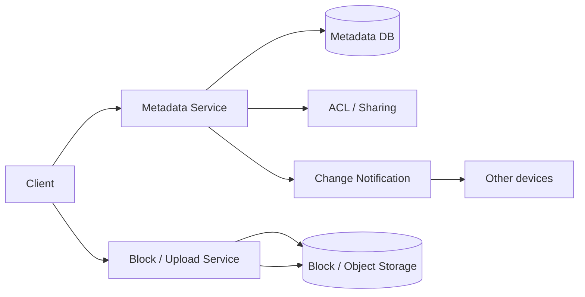
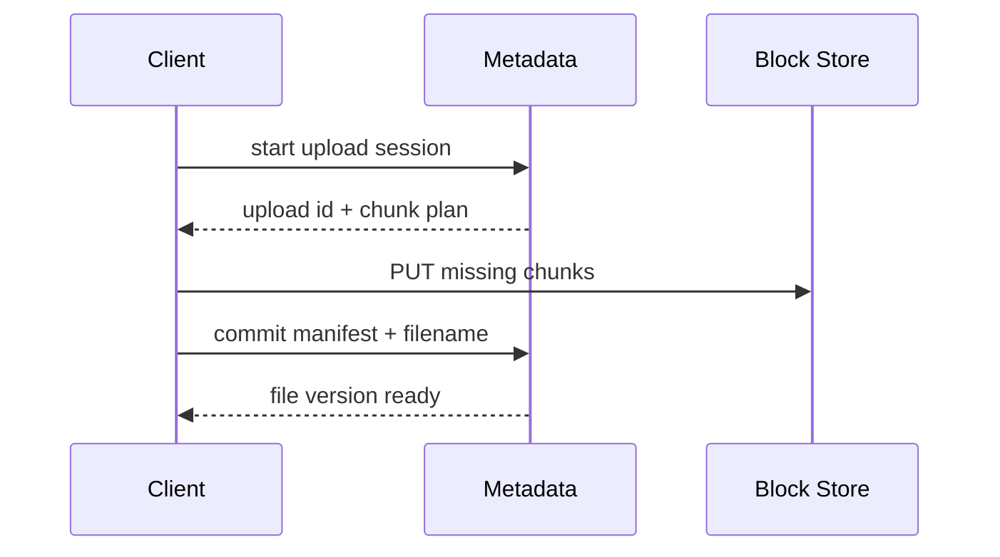
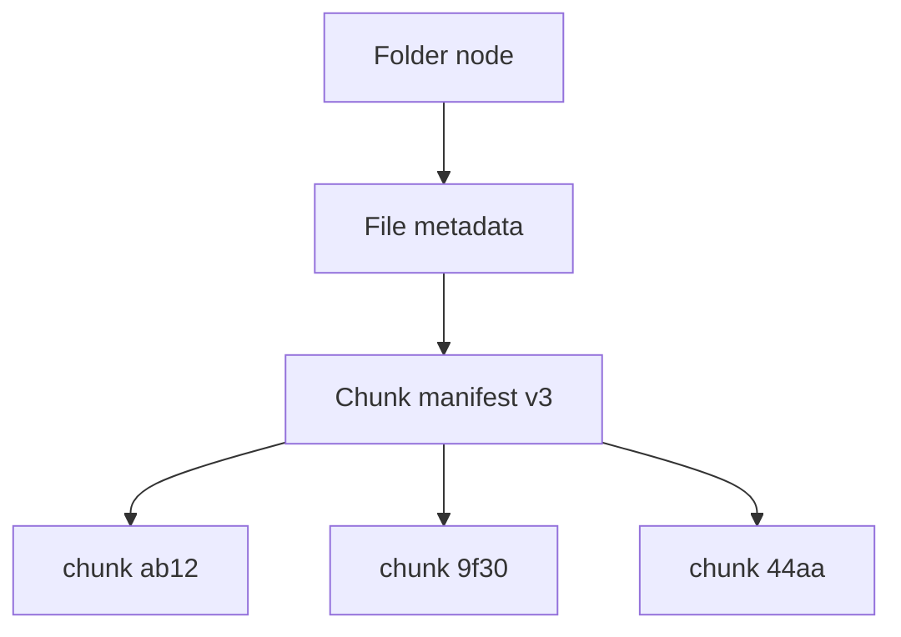

# Google Drive-like Storage

## The simple idea

A Drive-like product stores your files in the cloud, syncs them across devices, and lets you share with others. Users see folders and documents; underneath you separate **metadata** (names, tree, permissions) from **block/blob storage** (the bytes).

## Why it matters

Files are large, frequently edited, and shared. The system must upload reliably on flaky networks, sync without corrupting data, and enforce access control on every download.

## Clarify (requirements + rough numbers)

- **Features:** upload/download, folder hierarchy, sharing links, sync clients, version history (nice to have).
- **Constraints:** multi-GB files, resumable uploads, strong authz on every read.
- **Scale sketch:** 100M users, average 15 GB/user -> multi-exabyte storage planning; metadata ops are high QPS even when bytes are cold.
- **Consistency:** after an upload completes, that device should see the file; other devices soon after via notification/sync.

## High-level design

Metadata answers "what do I own / can I access?"; block storage holds chunked file bytes.

## Deep dive

### 1. Upload and download

**Download:** authz check -> return pre-signed URLs or stream via CDN for public/shared hot files.

**Upload (small files):** single PUT to storage, then commit metadata transaction (name, parent folder, size, content hash, block pointers).

**Upload (large files): block/chunk upload**

1. Client splits file into chunks (e.g. 4-8 MB) and hashes each chunk.
2. Client asks which chunks the server already has (**dedupe** / resume).
3. Client uploads missing chunks (parallel, retryable).
4. Client commits a manifest: ordered list of chunk ids -> new file version.

Idempotent chunk uploads make flaky Wi-Fi survivable.

### 2. Sync

Sync clients maintain a local revision cursor per namespace (user drive or shared folder).

- Server exposes `GET changes?since=rev`.
- Client applies creates/updates/deletes, then resolves conflicts (last-write-wins, or keep both copies on conflict -- product choice).
- Content-addressed chunks mean unchanged pieces are not re-uploaded when a file is lightly edited (especially with smaller block sizes or diffing).

For desktop sync, a local database tracks path <-> file id <-> version.

### 3. Metadata vs block storage

| Layer | Stores | Properties |
| --- | --- | --- |
| **Metadata** | tree, names, owners, ACLs, versions, chunk manifests | Low latency, transactional, relatively small |
| **Block storage** | opaque chunks / objects | Durable, cheap $/GB, high throughput |

Never store large blobs in the metadata DB. Metadata references content by hash/id so renames and copies can be cheap (copy-on-write manifests).

### 4. Sharing ACLs and change notifications

**ACLs:** per-file or per-folder entries: `user/group -> role` (viewer, commenter, editor, owner). Folder permissions may inherit downward unless overridden.

On every download or sync of bytes, **re-check ACL** (or a cached capability token with short expiry). Share links are capabilities with optional passwords and expiry.

**Notifications:** when metadata changes, push to:

- Other devices of the owner (sync wake-up).
- Shared users' clients.
- Optional email/push for "someone shared a doc with you."

Use a per-user change feed / pubsub so clients are not polling forever at high frequency.

## Key trade-offs

- **Large chunks vs small chunks:** fewer requests vs better dedupe and resume granularity.
- **Inheritance ACLs vs per-file ACLs:** easier UX vs harder cache invalidation.
- **Last-write-wins vs manual conflict copies:** simplicity vs zero data loss perception.
- **Inline virus scan vs async:** safer open vs faster commit.

## Remember

- Split metadata and block bytes cleanly.
- Use chunked, resumable, content-addressed uploads for large files.
- Sync via a change log / revision cursor, not full tree scans every time.
- Enforce ACLs on read paths; inherit carefully.
- Notify devices of changes so sync stays near real time.
