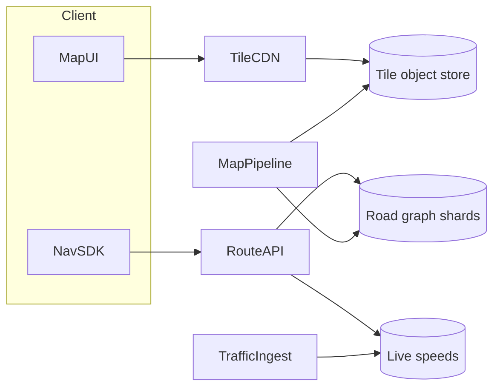

# Google Maps-like Service

## The simple idea

A maps product does three big jobs: show the world (tiles), get you from A to B (routing), and tell you when you'll arrive (ETA), adjusted for traffic. Underneath sits a heavy data pipeline that keeps roads, places, and speeds up to date.

You will not rebuild all of Google Maps in one interview. You will show you understand the pieces and how they talk.

## Why it matters

Maps combine static geography with live conditions. Tiles are cache-friendly blobs. Routes need graph algorithms on a huge road network. ETAs need fresh speed data. Traffic and map edits never stop. The system is part CDN, part graph compute, part streaming analytics.

## Clarify

- **Features in scope**: browse map, search places, turn-by-turn nav, traffic layer, offline?
- **Clients**: mobile, web, embedded SDK?
- **Freshness**: how often do road edits and traffic update?
- **Regions**: one country first, or global?
- **Accuracy bar**: consumer driving nav vs logistics SLAs?
- **Offline**: download regions?

Sensible cut: tile serving + routing + ETA with a traffic overlay; place search can reuse proximity ideas.

## High-level design

- **Tiles**: pre-rendered (or vector) map squares by zoom level, served from CDN.
- **Routing**: pathfinding on a road graph, biased by live edge weights (travel time).
- **ETA**: sum of expected segment times along the chosen path, refreshed as conditions change.
- **Pipeline**: imports OSM/vendor maps, builds tiles and graph snapshots, streams probe speeds into traffic.

## Deep dive

### Map tiles

The map is a pyramid of squares. Zoom 0 is the world; each deeper zoom splits tiles into four.

- **Raster tiles**: PNG/JPEG images. Simple clients; heavier storage.
- **Vector tiles**: geometry + style on device. Sharper, smaller, themeable; more client work.

Serving path:

1. Client computes tile `x/y/z` for the viewport.
2. Request hits CDN -> origin tile store (object storage).
3. Missing tiles can be rendered on demand, but production systems pre-generate common zooms.

Tiles are perfect for aggressive caching and HTTP cache headers. Version tiles when the basemap ships so clients do not mix old and new geometry.

### Navigation and routing

Model roads as a **directed graph**: intersections = nodes, road segments = edges with length, speed limit, turn restrictions, road class.

Routing algorithm family:

- Dijkstra / A* for smaller regions.
- Contraction hierarchies, hub labels, or similar preprocessed indexes for continental graphs.

Practical API:

- Input: origin, destination, mode (drive/walk/bike), avoidances (tolls, highways).
- Output: polyline, turn list, distance, baseline ETA.
- Shard the graph by region; long trips stitch corridors or use hierarchical routing (local detail + highway backbone).

Recalculate when the user goes off-route: keep a lightweight replanner on a hot path, not a cold batch job.

### ETA

ETA is not distance / speed limit.

- Weight each edge by **expected travel time** from traffic + historical patterns (time of day, day of week).
- Sum along the route; add intersection delay models if you have them.
- Update ETA as the trip progresses and as traffic ahead changes.
- Uncertainty: show ranges when confidence is low (accidents, sparse data).

### Traffic

Sources: phone GPS probes (opt-in), fleet partners, road sensors, incident reports.

Pipeline sketch:

1. Ingest anonymized speed samples on road segments.
2. Aggregate into short windows (e.g. 1-5 minutes) per edge.
3. Smooth and detect incidents (sudden drops).
4. Publish edge travel-time multipliers to routing/ETA services.
5. Render a traffic color layer for the map (often separate tiles or vector attributes).

### Data pipeline overview

Think in layers of freshness:

| Layer | Examples | Cadence |
| --- | --- | --- |
| Basemap | New roads, closures, geometry | Hours-days batch builds |
| Graph snapshot | Routing edges/nodes | Tied to basemap releases |
| Traffic live | Speeds, incidents | Seconds-minutes stream |
| Derived tiles | Raster/vector tiles | Per basemap release (+ traffic overlays more often) |

Build artifacts are versioned. Routing servers load graph versions atomically so a request never mixes half-applied maps.

## Key trade-offs

| Choice | Upside | Downside |
| --- | --- | --- |
| Raster tiles | Easy clients | Large storage; poor restyle |
| Vector tiles | Flexible styling; smaller | Heavier client rendering |
| Deep graph preprocessing | Fast long routes | Slow to rebuild after map edits |
| Live traffic in weights | Better ETA | More moving parts; noisy data |
| Huge global graph | One system | Harder ops; prefer regional shards |

## Remember

- Maps = **tiles (CDN)** + **road graph routing** + **traffic-weighted ETA**.
- Tiles love caching; version them with basemap releases.
- Routing is graph search with preprocessing for scale; replan on off-route.
- ETA depends on live and historical segment speeds, not speed limits alone.
- Separate slow basemap builds from fast traffic streams--different freshness, different pipelines.
