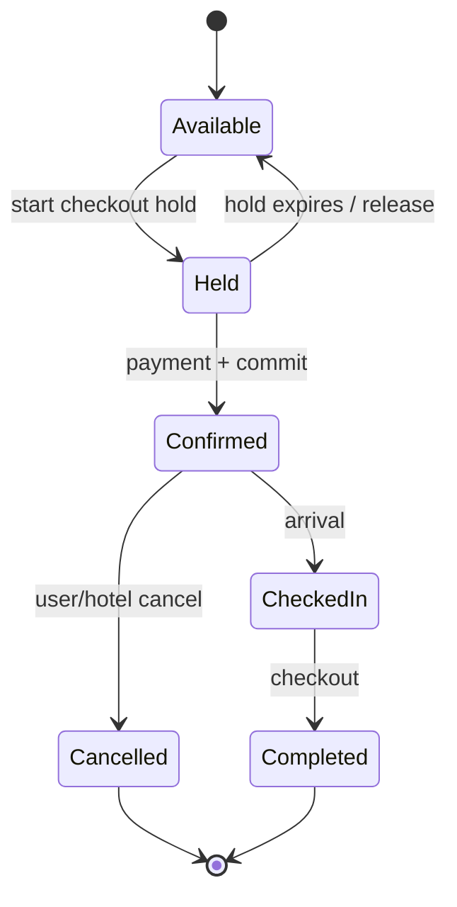
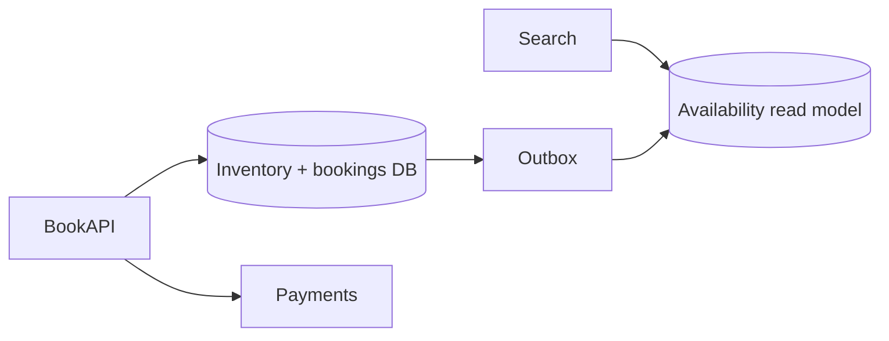

# Hotel Reservation System

## The simple idea

A hotel reservation system tracks room inventory and lets guests book nights without two people getting the same room for overlapping dates. Search must feel fast. Booking must be correct under concurrency. The scary bug is double booking.

## Why it matters

Overbooking a place catalog is embarrassing. Overbooking a paid room is a support crisis and a refund. Reads (availability search) dwarf writes (bookings), but writes need strong conflict control. You separate a scalable read model from a careful booking transaction.

## Clarify

- **Inventory unit**: specific room numbers, or room types (king / twin) with a count?
- **Hold behavior**: soft hold while checkout? How long?
- **Overbooking policy**: never, or intentional airline-style oversell?
- **Channels**: website, apps, OTAs (Booking.com) competing for the same rooms?
- **Timezone / night definition**: check-in date rules?
- **Cancel / modify**: refund windows, waitlists?

Default: book by room type + date range, short soft holds, no silent oversell, strong final commit.

## High-level design





Search hits a denormalized availability store. Booking hits the source-of-truth inventory with concurrency control, then async updates the read model.

## Deep dive

### Inventory model

Two common models:

1. **Room type counts**: `hotel_id + room_type + date -> remaining`. Simpler; hotels often sell this way.
2. **Named rooms**: each physical room has a calendar. More precise for assignments; heavier.

Many systems reserve on **type + dates**, then assign a concrete room near check-in.

Store bookings as date ranges (or expanded night rows). Night rows make constraint checks and indexed searches easier:

```text
inventory(hotel_id, room_type, stay_date, total, remaining)
booking(booking_id, status, ...)
booking_nights(booking_id, hotel_id, room_type, stay_date)
```

### Avoiding double booking

You need one clear conflict story when two guests commit the last room.

**Optimistic concurrency**

- Read version / remaining count.
- Commit `UPDATE ... SET remaining = remaining - 1, version = version + 1 WHERE version = old`.
- If no row updated -> retry or fail "sold out."

Good when conflicts are rare.

**Pessimistic locking**

- `SELECT ... FOR UPDATE` on inventory rows for the date span, then decrement.
- Serializes writers for that hotel/type/dates.

Good for hot properties; watch lock duration (never hold locks across payment redirects).

**Database constraints**

- Unique constraints on assigned room + night.
- Check constraints / triggers preventing remaining < 0.
- For named rooms: forbid overlapping ranges (exclusion constraints where supported).

Use constraints as the **last seatbelt**, not the only design.

Practical booking flow:

1. Soft **hold** (TTL 5-15 min) decrementing holdable inventory or writing hold rows.
2. Collect payment **idempotently** (payment key = booking id).
3. **Confirm** hold -> confirmed booking in one short transaction.
4. Expire holds with a sweeper that restores inventory.

Never leave inventory decremented without a hold/booking row that a job can heal.

### Reservation state machine

States keep ops sane:

- `held` -> `confirmed` -> `checked_in` -> `completed`
- `held` -> `expired`
- `confirmed` -> `cancelled` (restore inventory if policy allows)

Every transition should be explicit, audited, and idempotent under retries.

### Scaling availability reads

Search traffic is huge compared to bookings.

- Maintain a **read model**: remaining by hotel/type/date, or even precomputed "open calendar" bitmaps.
- Cache popular hotel pages and city search results with short TTL.
- Update read model via CDC/outbox from the booking DB--accept brief lag; booking path remains authoritative.
- Shard inventory by hotel_id; geographic search indexes (city -> hotel IDs) sit in a search cluster.
- For date-range queries, avoid scanning unbounded history--index upcoming nights heavily.

If the read model says available but commit races to zero, return a clean sold-out at confirm time.

## Key trade-offs

| Choice | Upside | Downside |
| --- | --- | --- |
| Room-type inventory | Simpler selling | Assignment later |
| Named-room inventory | Exact control | More conflicts / complexity |
| Optimistic locking | High read concurrency | Retries under contention |
| Pessimistic locking | Predictable under hot keys | Lock waits; careful TX design |
| Soft holds | Better checkout UX | Temporary "false" scarcity |
| Heavily cached availability | Fast search | Possible stale "available" until commit |

## Remember

- Split **fast availability reads** from **correct booking writes**.
- Prevent double booking with optimistic/pessimistic control **plus** DB seatbelts.
- Use a clear hold -> confirm state machine; expire holds automatically.
- Idempotent payment and booking IDs save you during retries.
- Stale search is OK; a false confirm is not--authoritative check happens at commit.
