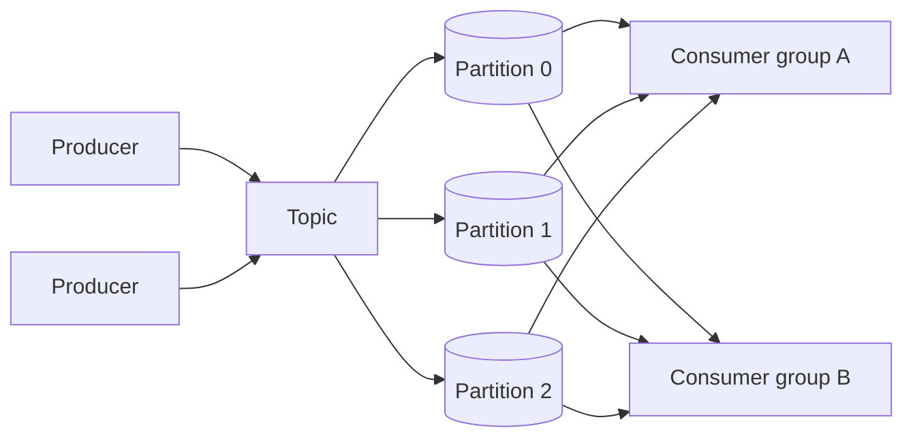

# Distributed Message Queue

## The simple idea

A message queue moves events from producers to consumers without forcing them to talk at the same time. Producers publish. Consumers process when ready. Topics organize streams. Partitions split a topic so many machines can read and write in parallel.

Think Kafka-style log: durable, ordered within a partition, replayable.

## Why it matters

Queues decouple services. Checkout should not wait on email, analytics, and fraud in one fragile call chain. At scale you need partitioning for throughput, replication for durability, and clear delivery promises so teams know what "processed" means.

## Clarify

- **Throughput and latency**: millions of msgs/sec? Sub-second end-to-end?
- **Retention**: delete after consume, or keep for days of replay?
- **Order**: global order (hard) or per-key order (common)?
- **Delivery**: at-most-once, at-least-once, or exactly-once *effect*?
- **Fanout**: many independent consumer teams on one topic?
- **Payload size**: tiny events vs multi-MB blobs (usually store blob elsewhere)?

Default: high-throughput append log, per-key ordering, at-least-once delivery, consumer groups.

## High-level design

- **Topic**: named stream (e.g. `orders`).
- **Partition**: ordered append-only log slice of a topic.
- **Producer**: picks partition (often by key hash) and appends.
- **Consumer group**: competing consumers; each partition goes to one member for parallel processing without double-work inside the group.
- **Second group**: independent progress--analytics can lag behind billing.

## Deep dive

### Topics and partitions

Partitions give you scale and ordering:

- Messages with the same key (user ID, order ID) go to the same partition -> **order preserved per key**.
- More partitions -> more parallel consumers (up to one active consumer per partition per group).
- Too many partitions -> more metadata, slower rebalances, more open files.

Choose partition count for peak parallelism, not for decoration.

### Producers and consumers

**Producers** batch records, retry on transient failure, and may wait for ack from the leader (and optionally in-sync replicas).

**Consumers** pull (or push, depending on system), process, then commit offsets--"I have handled up to position N."

Keep processing **idempotent** whenever you can: the same message may appear more than once under at-least-once.

### Consumer groups

A group is a team sharing work:

- Coordinator assigns partitions to members.
- If a member dies, partitions rebalance to survivors.
- Each group tracks its own offsets, so multiple apps can read the same topic at different speeds.

Rebalances pause work briefly--design consumers to finish or fence work cleanly.

### Replication

Each partition has a **leader** and **followers**.

- Writes go to the leader; followers replicate the log.
- Durability knob: ack when leader only vs when enough replicas are in sync.
- If the leader fails, a caught-up follower becomes leader.

Replication protects disks and machines, not bad application logic. Poison messages still need DLQs or skip policies.

### Delivery semantics (high level)

| Semantic | Meaning | Typical approach |
| --- | --- | --- |
| At-most-once | May lose messages; no dupes | Commit before process / fire-and-forget |
| At-least-once | No silent loss; possible dupes | Process then commit; retries on failure |
| Exactly-once (effect) | Downstream sees one effect | Idempotent writes + transactional outbox / EOS features |

"Exactly-once" in distributed systems usually means **exactly-once processing effect**, not magic physics. You combine careful offset commits, idempotent sinks, and sometimes broker transactions. Explain the effect you guarantee; do not hand-wave.

### Backpressure

When consumers lag:

- Lag metrics (end offset - committed offset) page humans.
- Autoscale consumers until partition limit.
- Slow producers or apply admission control if the backlog threatens disk.
- Spill to longer retention only as a buffer--disk is not infinite.
- Drop or sample only for use cases that allow loss (rare for money paths).

Backpressure is a conversation between producer rate, partition count, consumer CPU, and retention.

## Key trade-offs

| Choice | Upside | Downside |
| --- | --- | --- |
| More partitions | Higher parallelism | Heavier ops / rebalances |
| Require multi-replica ack | Safer durability | Higher publish latency |
| Long retention | Easy replay | Storage cost |
| At-least-once | Simple & safe default | Must handle duplicates |
| Strong EOS tooling | Cleaner sinks | Complexity; throughput cost |

## Remember

- A modern queue is often a **partitioned, replicated append log**.
- Order is per partition (and thus per key)--not global.
- Consumer groups share work; separate groups replay independently.
- Prefer **at-least-once + idempotent consumers**; treat exactly-once as an end-to-end effect.
- Watch lag and plan backpressure before the disk fills.
