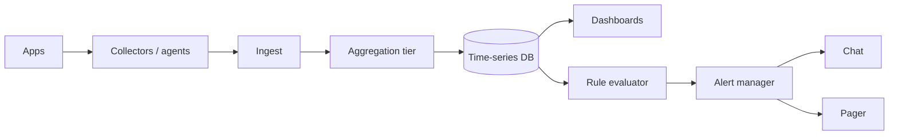

# Metrics Monitoring & Alerting

## The simple idea

Monitoring answers: "Is the system healthy, and if not, who should wake up?" Apps and machines emit metrics (CPU, request latency, error counts). Collectors ship them to a time-series database. Dashboards visualize trends. An alert manager pages people when rules fire.

Good monitoring is not more graphs. It is the right signals, cheap storage, and alerts that mean something.

## Why it matters

Without metrics you debug by guessing. With unbounded metrics you drown in cardinality and cost. Alert storms burn on-call trust. This design ties ingestion, aggregation, storage, and notification into one loop.

## Clarify

- **Metric types**: counters, gauges, histograms/percentiles?
- **Volume**: series count, points per second, retention (raw vs downsampled)?
- **Alert channels**: PagerDuty, Slack, email?
- **Multi-tenant?** one company vs SaaS monitoring many customers?
- **SLOs**: burn-rate alerts vs raw threshold pages?
- **Logs/traces?** related but usually separate pipelines--mention boundaries.

Default: internal platform metrics, Prometheus-like pull or push agents, TSDB, rule-based alerts, Grafana-style dashboards.

## High-level design

1. Agents scrape or receive metrics from processes and hosts.
2. Ingest path validates, fans out, and may pre-aggregate.
3. TSDB stores timestamped samples keyed by metric name + labels.
4. Dashboards query ranges; rule engine evaluates alert expressions.
5. Alert manager dedupes, groups, silences, and routes notifications.

## Deep dive

### Collectors

Two common patterns:

- **Pull**: central scraper hits `/metrics` on each target (service discovery helps).
- **Push**: apps push to a gateway (short jobs, edge devices, some languages).

Agents should:

- Discover targets (K8s, Consul, static config).
- Attach base labels (service, instance, region) carefully.
- Bound scrape intervals (15-60s typical for many systems).
- Expose agent health so you notice "monitoring is down."

### Aggregation

Raw high-frequency samples get expensive. Aggregate early when possible:

- Per-instance scrape -> local histograms.
- Recording rules: precompute `http_errors_ratio` every minute.
- Downsample old data: 15s resolution for 1 day, 1m for 2 weeks, 5m for months.

Keep aggregation **lossy on purpose** for old data; keep raw fine-grained only as long as debugging needs it.

### Time-series database

A TSDB is optimized for append-mostly numeric streams:

- Key: metric name + label set -> series ID.
- Value: `(timestamp, float)` samples.
- Queries: range selects, rate(), percentiles via histograms.

Write path cares about compression and sequential ingest. Read path cares about indexing series by label and scanning time ranges efficiently. Shard by time and/or by series hash for scale.

Retention policies and cold storage tiers keep cost predictable.

### Alert manager

Rules say *what* is wrong. Alert manager decides *how* humans hear it:

- **Dedupe** repeated firings of the same alert.
- **Group** related alerts ("50 instances OOM" -> one page).
- **Silence** during maintenance windows.
- **Route** by label (team, severity, service).
- **Inhibit** low-severity noise when a high-severity parent is firing.

Pages should be rare, actionable, and owned. Prefer SLO burn-rate or symptom alerts (user errors, latency) over every disk tick.

### Dashboards

Dashboards are for exploration and incident context:

- Golden signals: latency, traffic, errors, saturation.
- Drill from service overview -> instance -> endpoint.
- Template variables for region/cluster.
- Avoid wallpaper dashboards nobody understands--tie panels to runbooks.

### Cardinality warning

Cardinality = number of unique time series.

Dangerous label choices explode storage and query time:

- User IDs, request IDs, full URLs, emails as labels.
- Unbounded `pod_name` churn without aggregation elsewhere.

Guardrails:

- Block high-cardinality labels at ingest.
- Budget series per service.
- Prefer histograms with bounded buckets over a label per latency value.
- Sample or aggregate before labels multiply.

One careless label can cost more than your primary database.

## Key trade-offs

| Choice | Upside | Downside |
| --- | --- | --- |
| Pull scrape | Simple targets; central control | Needs reachable endpoints |
| Push gateway | Fits batch / ephemeral jobs | Can hide stale metrics |
| Long raw retention | Great forensics | Expensive |
| Aggressive downsample | Cheap | Less detail for old incidents |
| Many precise alerts | Catch edge cases | Pager fatigue |
| Symptom / SLO alerts | Actionable | Need good SLIs first |

## Remember

- Pipeline: **collect -> aggregate -> TSDB -> dashboards + alert manager**.
- Alert routing needs grouping, silence, and ownership--not just thresholds.
- Cardinality kills: never put unbounded IDs in metric labels.
- Downsample with age; keep fine detail only while it pays for itself.
- Page on user-visible symptoms; use dashboards for deep diagnosis.
