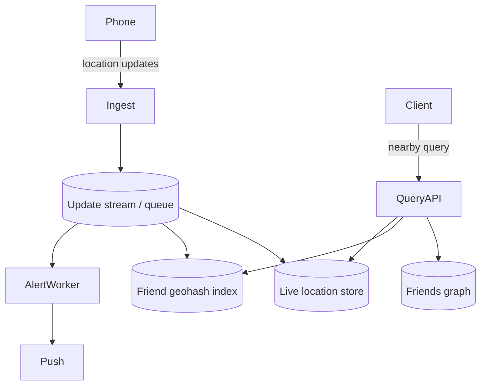

# Nearby Friends

## The simple idea

Nearby Friends answers: "Which of my friends are close to me right now?" Users share live location. The app shows friends on a map or sends a ping when someone enters your radius.

Unlike a places catalog, locations move constantly. The system is a stream of updates plus a way to ask "who is near this point among my friends?" without scanning the whole world.

## Why it matters

Phones send location often. Millions of users x frequent updates = a write-heavy geo problem. You also burn battery if you nag GPS too hard, and you leak privacy if you overshare. The design must balance freshness, cost, and consent.

## Clarify

- **Who can see me?** Friends only? Mutual friends? Opt-in per session?
- **Freshness**: update every 30s? Only when moving? Only when app is open?
- **Radius**: fixed (e.g. 500 m) or map viewport?
- **Push vs pull**: live map polling, or "friend nearby" notifications?
- **Scale**: DAU sharing location, updates per second, friends-graph fanout?
- **Offline / background**: still share when app is backgrounded?

Default scope: mutual friends, foreground sharing, map view + optional proximity alerts.

## High-level design

1. Phone uploads location (batched, with consent flags).
2. Ingest validates user, writes latest point, updates geo index.
3. Query API loads friend IDs, finds which of those sit in nearby cells, returns filtered list.
4. Optional workers watch distance changes and fire push alerts.

## Deep dive

### Location update stream

Treat updates as an event stream, not chatty synchronous writes only:

- Client sends `{userId, lat, lng, accuracy, ts, sharingMode}`.
- Gateway rate-limits and drops noisy duplicates (tiny moves inside accuracy radius).
- Queue absorbs spikes (concerts, stadiums).
- Consumers upsert "latest location" and refresh the user's geohash cell membership.

Keep **one latest point per user** for the live map. History (breadcrumb trails) is a separate, optional store with retention limits.

### Geohash for friends

You do not need every stranger in a cell--only friends.

Two workable patterns:

1. **Cell -> active user IDs**: query neighbor cells, intersect with friend set.
2. **Per-user friend check**: for each friend, read last location and compute distance (fine for small friend lists).

At scale with large friend graphs or "people nearby in this event," prefer cell indexes. For typical social graphs (tens to low hundreds of friends), reading friends' latest points from a cache is often enough and simpler.

Hybrid: maintain geohash -> user for users currently sharing; always intersect with friend IDs from the graph service.

### Who is nearby

Query steps:

1. Auth + load friend IDs (cached).
2. Compute geohash neighbors for the requester's point.
3. Fetch candidate user IDs in those cells who are sharing.
4. Intersect with friends.
5. Exact distance filter + sort by distance.
6. Return display fields (name, avatar, last-updated age).

Show "last seen 2 min ago" so users understand staleness.

### Battery and update frequency

Battery is a product constraint:

- **Adaptive cadence**: frequent updates while moving fast; slow down when still.
- **Significant-change API** on mobile OS: wake only after N meters.
- **Server hints**: tell the client "your friends are idle--upload less often."
- **Batch & compress**: send updates over the existing push/websocket channel when possible.
- Cap accuracy: city-level sharing costs less than precise GPS.

Never design for 1 Hz GPS from every user. That melts batteries and your bill.

### Privacy (brief)

- Explicit opt-in; easy off switch.
- Share with friends only by default; never global unless that is the product.
- Precision modes: exact, approximate (fuzzy geohash), or city-only.
- Retention: delete or expire live points quickly after sharing stops.
- Audit: user can see who received their location recently if the product requires it.

Privacy is not a footnote--bad defaults kill trust faster than slow maps.

## Key trade-offs

| Choice | Upside | Downside |
| --- | --- | --- |
| High update rate | Fresher map | Battery + write load |
| Cell index | Scales beyond large friend lists | More infra; edge cases at cell borders |
| Per-friend point reads | Simple | Weak if friend count or density explodes |
| Push alerts | Delightful "nearby" moments | Alert spam; harder correctness |
| Fuzzy location | Better privacy | Worse "are they next door?" UX |

## Remember

- Nearby Friends is a **live update stream + latest-point store + friend-scoped geo query**.
- Geohash (or grid) helps when candidates are many; small friend lists can stay simple.
- Tune update frequency for battery--adaptive beats constant GPS.
- Consent, retention, and precision modes are part of the design, not polish.
- Always show staleness; "live" without a timestamp misleads users.
