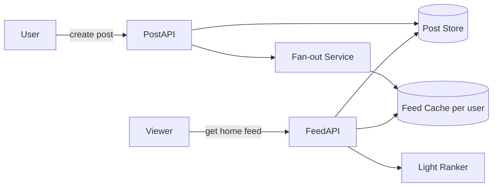
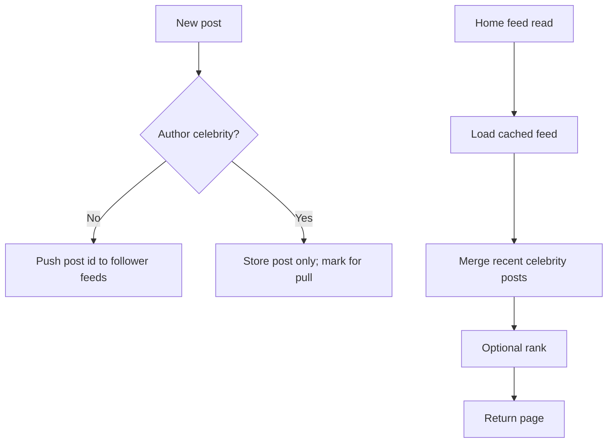

# News Feed System

## The simple idea

When you open a social app, the home feed shows recent posts from people you follow. Behind the scenes, the system must **write** posts once and **read** them fast for millions of users -- often by pre-computing each person's feed.

## Why it matters

Feeds are classic **fan-out** problems: one post may need to reach thousands or tens of millions of followers. The design choice (push, pull, or hybrid) dominates cost and latency.

## Clarify (requirements + rough numbers)

- **Features:** publish post, home timeline, optional ranking, media attachments.
- **Graph:** follow model (asymmetric) or friends (symmetric)?
- **SLAs:** feed load under a few hundred ms; publish can be a bit slower.
- **Numbers sketch:** 100M users, average 500 follows, 2 posts/user/day. Reads far exceed writes. Celebrity accounts may have 50M+ followers -- that single fact changes the architecture.

## High-level design

Publish writes the post, then fans it out. Read mostly hits a precomputed feed cache.

## Deep dive

### 1. Post + fan-out models

**Push (fan-out on write)**  
When Alice posts, write the post id into every follower's feed list (Redis list/ZSET, or similar).

- Pros: reads are fast and simple.
- Cons: write amplification; celebrities explode the cost.

**Pull (fan-out on read)**  
When Bob opens the feed, fetch recent posts from everyone he follows and merge-sort by time.

- Pros: publishes are cheap.
- Cons: slow/expensive reads, especially with large follow graphs.

**Hybrid (most real systems)**  
- Normal users -> push into followers' caches.
- Celebrities / high-degree users -> skip full push; pull their posts at read time and merge.

### 2. Feed cache shape

A common pattern: per-user Redis ZSET of `(timestamp, post_id)` with a capped length (e.g. last 1000 items). Pagination uses the score/cursor.

On cache miss (new user, eviction), rebuild from the social graph + post store -- expensive, so keep TTL and capacity tuned.

Store post **metadata** separately from the feed pointers. The feed cache holds ids; a post service / cache fills bodies, media URLs, and author cards in a batch get.

### 3. Ranking (brief)

Chronological is the interview baseline. If you add ranking:

- Keep a candidate set (cached feed + celebrity pulls).
- Score with simple signals: recency, affinity (how often you engage with that author), content type.
- Always be ready to fall back to time order if the ranker fails.

Do not over-build ML in a 45-minute interview -- show where it plugs in.

### 4. The celebrities problem

If you naively push one celebrity post to 50M feeds:

- Publish latency spikes.
- Redis / DB write QPS melts.
- Most followers never open the app soon anyway.

**Mitigations:** hybrid fan-out, rate-limit reconstruction, shard feed caches, async workers with backpressure, and sometimes "soft" fan-out only to recently active followers.

Also plan for **inactive users**: skipping push to accounts that have not opened the app in weeks cuts a huge fraction of wasted writes. When they return, rebuild their feed on demand.

## Key trade-offs

- **Push vs pull vs hybrid:** read latency vs write cost vs complexity.
- **Chronological vs ranked:** predictability vs engagement.
- **Cache everything vs rebuild:** memory cost vs spike risk on miss.
- **Fan-out to all followers vs active followers only:** completeness vs efficiency.

## Remember

- Home feed is mostly a precomputed list of post ids plus a merge step.
- Use hybrid fan-out to handle celebrities.
- Cache feeds for fast reads; keep post bodies in a separate store.
- Mention ranking as an optional layer on candidates.
- Watch write amplification -- it is the main scaling villain.
- Start with push for normal users, then introduce hybrid when celebrities appear.
- Keep the first interview sketch simple: post store, fan-out workers, per-user feed cache, read API.
- Start the interview answer with push for normal users, then introduce hybrid when the celebrity case appears.
