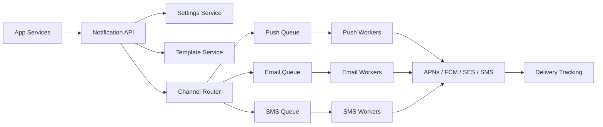
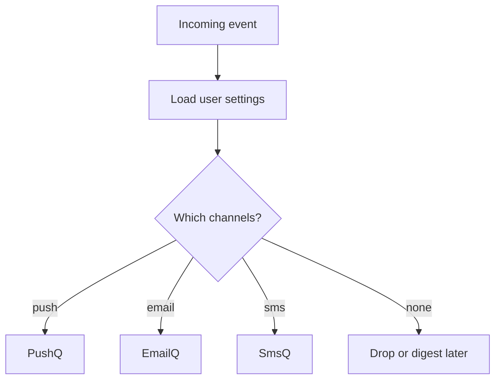
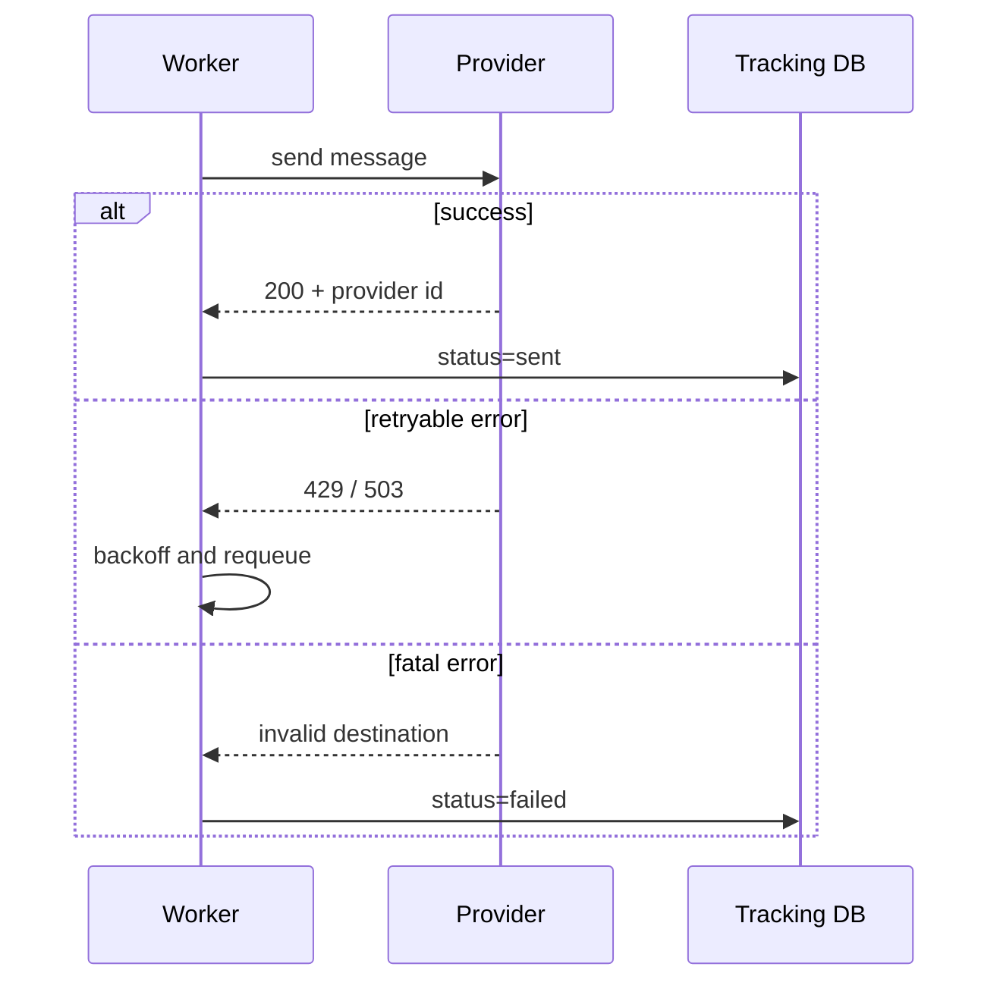

# Notification System

## The simple idea

A notification system takes an event ("order shipped") and delivers a message to the user on one or more channels: **push**, **email**, or **SMS**. It must be reliable, respectful of preferences, and gentle with third-party providers.

## Why it matters

Apps live or die on timely alerts — but spamming users or burning through SMS budgets is worse than silence. Interviews use this problem to test queues, fan-out, retries, and rate limiting.

## Clarify (requirements + rough numbers)

- **Channels:** push (APNs/FCM), email (SES/SendGrid), SMS (Twilio-like).
- **Triggers:** user actions, system events, marketing campaigns (often separate priority).
- **Settings:** quiet hours, per-channel opt-in, frequency caps.
- **Scale example:** 10M DAU, average 5 notifications/user/day → ~600 events/sec average, with sharp spikes during launches or outages.
- **SLA:** transactional messages (password reset) need higher priority than "we miss you" emails.

## High-level design

One write path in; many channel-specific outboxes.

## Deep dive

### 1. Gathering settings and choosing channels

Before enqueueing anything, load the user's notification preferences:

- Channel enabled? (email yes, SMS no)
- Device tokens / email / phone verified?
- Quiet hours or Do Not Disturb?
- Already notified about this event? (idempotency key)

Store settings in a fast store keyed by `user_id`. Cache aggressively; preferences change rarely relative to send volume.

### 2. Templates

Do not hardcode message text in every microservice. Keep **templates** with placeholders:

- `order_shipped.email.subject`: "Your order {{orderId}} shipped"
- Body variants per locale and channel (SMS must stay short).

The notification service renders templates with event payload data, then enqueues the final content (or a pointer to template + data for late rendering).

### 3. Queues per channel, rate limits, retries

**Why separate queues?** Push, email, and SMS have different providers, costs, failure modes, and rate limits. Isolating them stops a slow SMS API from blocking password-reset emails.

Workers pull from their queue and call providers with **client-side rate limiting** (token bucket / leaky bucket) so you stay under contractual QPS.

**Retries:** transient failures (timeouts, 429, 5xx) → exponential backoff with jitter. Permanent failures (invalid token, bounced email) → mark bad endpoint and stop retrying.

Use an **idempotency key** (`event_id + user_id + channel`) so at-least-once queues do not double-text users.

### 4. Tracking and digests

Record: queued → sent → delivered / bounced / clicked (when the channel supports callbacks). Webhooks from providers update status.

For low-priority noise, batch into a **daily digest** instead of ten separate emails. That is a product decision with a big reliability and UX payoff.

## Key trade-offs

- **Push now vs digest later:** urgency vs user fatigue.
- **One shared queue vs per-channel queues:** simplicity vs isolation.
- **Sync send in API vs async queues:** lower latency for critical paths vs smoother load.
- **Exact once vs at-least-once + idempotency:** distributed reality favors the latter.

## Remember

- Check settings before you send.
- Render templates centrally; keep channel payloads separate.
- One queue (and rate limiter) per provider/channel family.
- Retry with backoff; kill bad destinations; track delivery.
- Protect users and budgets with frequency caps and priorities.
