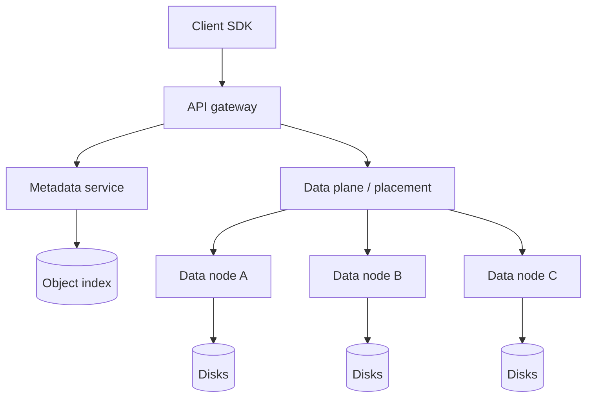
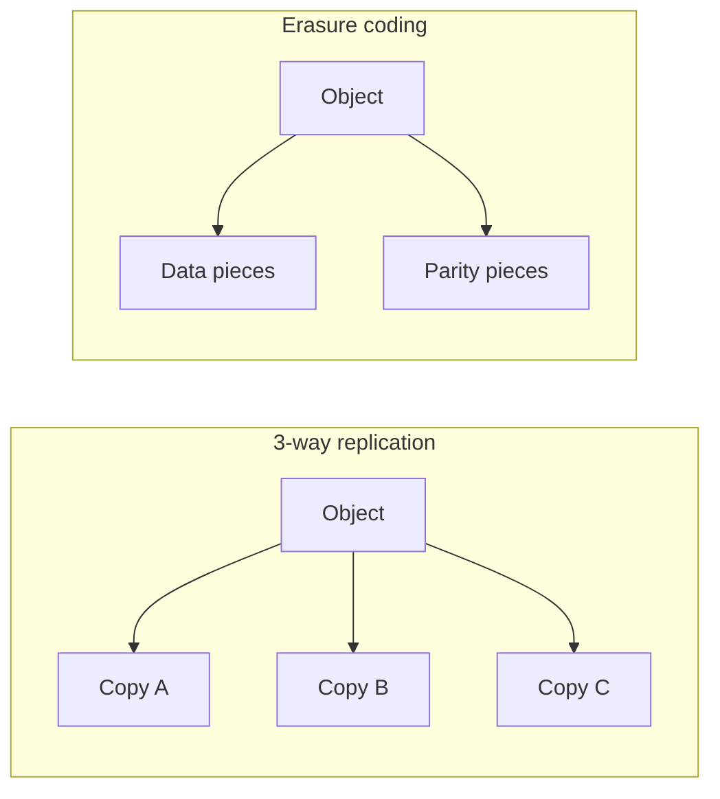

# S3-like Object Storage

## The simple idea

Object storage keeps **blobs** (files of any size) behind a simple key API: put, get, delete. A small **metadata service** remembers where each object lives; many **data nodes** hold the bytes. Durability comes from copying data or splitting it with erasure coding.

## Why it matters

Photos, videos, backups, and ML datasets are too big for a classic database. Interview designs often need a blob layer that is cheap, durable, and easy to scale horizontally.

## Clarify

- Read/write ratio? Object size distribution (KB vs multi-GB)?
- Consistency: must a GET always see the latest PUT right away?
- Durability target (e.g. "survive two disk failures")?
- Versioning, lifecycle rules, encryption, and multipart upload needed?
- Single region or multi-region?

Core API:

- `PUT /{bucket}/{key}` — store object (+ optional metadata headers)
- `GET /{bucket}/{key}` — fetch object
- `DELETE /{bucket}/{key}`
- `POST .../multipart/...` — upload large objects in parts
- `LIST` with prefix/pagination (harder than it looks)

## High-level design

## Deep dive

### Put object

1. Client authenticates and sends bucket + key + body (or multipart parts).
2. Control plane allocates a storage location (which nodes / chunks).
3. Data plane writes bytes to data nodes.
4. Only after enough durable copies (or coded fragments) succeed does metadata commit: key → location, size, checksum, version id.
5. Return success (often with etag/version).

If metadata commits before data is safe, you get ghost objects. Prefer **data first, then metadata**, or a two-phase "pending → ready" state.

### Get object

1. Look up key in metadata → locations + checksum + version.
2. Stream bytes from a healthy data node (or reconstruct from fragments).
3. Verify checksum before returning to the client when integrity matters.

Cache hot metadata aggressively. Large body traffic should hit data nodes (or edge caches), not the metadata DB.

### Metadata vs data nodes

| Layer | Role | Scale tip |
| --- | --- | --- |
| Metadata | Keys, versions, ACLs, pointers | Strong consistency help; shard by bucket/key hash |
| Data nodes | Raw chunks/blocks | Add disks and machines; keep nodes simple |
| Placement | Chooses nodes / failure domains | Spread across racks |

### Replication vs erasure coding (simple)

**Replication**: store N full copies (e.g. 3). Easy to reason about; uses more disk.

**Erasure coding**: split object into data pieces + parity pieces. You can lose some pieces and still rebuild. Uses less space than 3× copies, but repairs and cold reads cost more CPU and network.

Rule of thumb: hot / small objects → replication; cold / large archives → erasure coding.

### Versioning

With versioning on, each PUT creates a new **version id**. DELETE can add a delete marker instead of wiping history. GET without a version returns the latest. This protects against overwrite mistakes but grows storage — pair with lifecycle rules.

### Multipart upload

For multi-GB objects:

1. Start multipart → upload id
2. Upload parts in parallel (each part has a part number + etag)
3. Complete → server assembles (logically) and commits one object version

Parts should be independently durable. Incomplete uploads need a sweeper so abandoned parts do not leak forever.

## Key trade-offs

| Choice | Upside | Downside |
| --- | --- | --- |
| Replication | Simple repair, fast reads | Higher storage cost |
| Erasure coding | Lower storage cost | Heavier rebuilds |
| Strong metadata consistency | Fewer surprises | Harder multi-region |
| Versioning on | Safer overwrites | More cost and LIST complexity |
| Multipart | Reliable huge uploads | More API states to manage |

## Remember

- Separate metadata (where) from data (bytes).
- Commit metadata only after durability thresholds are met.
- Replication vs erasure coding is a cost/complexity dial; versioning and multipart are the features users feel day to day.
