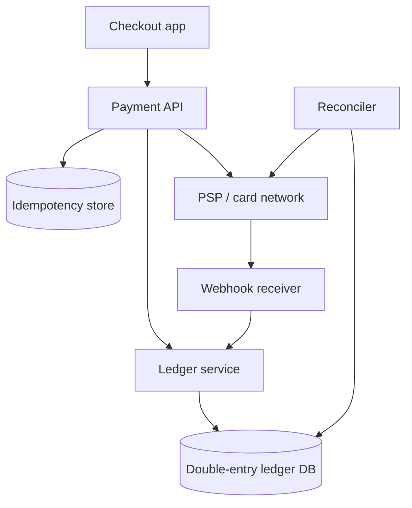

# Payment System

## The simple idea

A payment system takes money **in** (customer -> you) through a **payment service provider (PSP)**, records every movement in a **ledger**, and stays correct when networks retry. The golden rules: never double-charge, always be able to explain balances, and reconcile with the PSP later.

## Why it matters

Money bugs are existential. Retries, timeouts, and partial failures are normal. Design for **exactly-once business effect** even though the network is at-least-once.

## Clarify

- Pay-in only, or also payouts / refunds / chargebacks?
- Cards, wallets, bank transfer, or all of them?
- Who is merchant of record -- you or the PSP?
- Latency: sync confirmation vs async "processing"?
- Currencies, fees, partial captures, 3-D Secure?
- Compliance constraints (PCI: usually tokenize via PSP; do not store raw cards)?

APIs (sketch):

- `POST /payments` -- create payment intent `{ amount, currency, idempotencyKey }`
- `GET /payments/{id}` -- status
- `POST /payments/{id}/refund`
- Webhooks from PSP -> your status updates

## High-level design

## Deep dive

### Pay-in flow (happy path)

1. Client creates a payment with amount + **idempotency key**.
2. API creates a local payment row in `requires_action` or `processing`.
3. Call the PSP (or return PSP client secret for hosted/3DS flows).
4. On success (sync response or webhook): mark payment `succeeded` and post ledger entries.
5. Unlock the order / fulfill only after ledger says funds are recorded.

Prefer **webhooks as source of truth for final state**, with the sync response as a fast hint. Always verify webhook signatures.

### PSP boundary

The PSP handles card data, fraud tools, and bank rails. You store:

- payment id, PSP charge id, amount, currency, status
- customer/merchant references
- idempotency keys and audit logs

Never invent money movement that the PSP did not confirm -- and never "fix" status by guessing after a timeout. Re-read from the PSP or wait for the webhook.

### Ledger: double-entry in simple words

Think of every movement as **two sides that must balance**:

- Debit the customer's payable / PSP clearing account
- Credit your cash / revenue account (simplified)

Example: customer pays $10:

| Account | Debit | Credit |
| --- | --- | --- |
| PSP clearing | 10 | |
| Revenue | | 10 |

Refunds reverse the idea. The point is not fancy accounting -- it is that **balances are derived from append-only entries**, so you can audit how you got here.

Keep the ledger **immutable**. Fix mistakes with new correcting entries, not edits.

### Idempotency keys

Clients retry when requests time out. You must treat "same key + same merchant" as the same logical payment:

1. Look up key -> if prior success, return the same payment id/status.
2. If in flight, return "processing" (or wait), do not start a second PSP charge.
3. Store a hash of the request body so a reused key with different amount is rejected.

### Retries

| Layer | Retry? | Notes |
| --- | --- | --- |
| Client -> your API | Yes | Must send idempotency key |
| Your API -> PSP | Careful | Only with PSP idempotency; avoid double capture |
| Webhook delivery | Yes (PSP side) | Your handler must be idempotent |
| Fulfillment | Yes | Gate on payment status, not on "I think it worked" |

Use exponential backoff. Distinguish retryable errors (timeouts, 5xx) from hard declines.

### Reconciliation

Daily (or more often):

1. Pull PSP settlement / transaction reports.
2. Match to ledger rows by PSP ids.
3. Flag missing webhooks, amount mismatches, and late captures.
4. Alert humans for breaks; auto-fix only safe, well-defined cases.

Reconciliation is how you sleep at night when webhooks get lost.

## Key trade-offs

| Choice | Upside | Downside |
| --- | --- | --- |
| Trust sync PSP response only | Faster demo | Misses async failures |
| Webhook-driven finality | Accurate | Need secure, idempotent handlers |
| Full double-entry ledger | Auditable | More modeling work |
| Single "balance" field | Simple | Hard to explain disputes |
| Aggressive auto-retry to PSP | Higher success | Double-charge risk without keys |

## Remember

- Idempotency keys turn retries into safety, not danger.
- Record money in an append-only ledger; reconcile with the PSP.
- Timeouts are not failures -- look up state before charging again.
