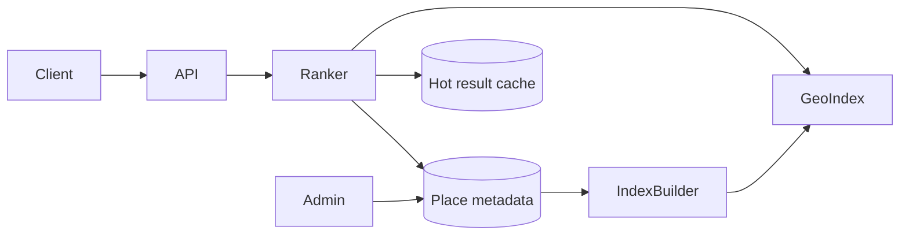

# Proximity Service

## The simple idea

A proximity service answers: "What interesting places are near me?" Think Yelp, Google Places, or a food-delivery map. The user sends a latitude and longitude. You return a ranked list of restaurants, shops, or POIs within some radius.

The hard part is not storing places. It is searching millions of lat/long points quickly, then ranking them so the first page feels useful.

## Why it matters

Naive scan of every place on Earth does not scale. Even "load everything in this city" becomes expensive when users zoom, pan, and filter constantly. You need a geo index so nearby queries touch only a small slice of data, plus a read path that stays cheap under heavy traffic.

## Clarify

Ask before you draw boxes:

- **Radius and zoom**: fixed 1-5 km? Or whatever the map viewport shows?
- **Filters**: category, open now, price, rating, dietary tags?
- **Freshness**: are hours and menus updated often?
- **Ranking**: distance only, or mix of distance + rating + popularity?
- **Write vs read mix**: places change slowly; searches dominate.
- **Scale**: how many places, QPS, and peak cities?

A good interview default: mostly static place catalog, high read QPS, ranked nearby list with category filters.

## High-level design

Flow in words:

1. Client sends `lat`, `lng`, radius (or viewport), filters, and page cursor.
2. API asks the geo index for candidate place IDs in that region.
3. Service loads metadata (name, rating, hours) for those IDs.
4. Ranker scores and returns the top page.
5. Hot city/category queries may hit a short-TTL cache.

## Deep dive

### Geo indexing: geohash vs quadtree

Both turn 2D space into buckets you can look up fast.

**Geohash** encodes lat/long into a string. Nearby points usually share a prefix. Longer prefix = smaller cell. To search a radius, compute the user's geohash (and neighbor cells so edges are not missed), then fetch places whose geohash starts with those prefixes.

**Quadtree** (or grid / R-tree variants) recursively splits the map into four rectangles. Dense downtowns get deeper trees; sparse countryside stays coarse. Query: walk cells that intersect the search circle.

Practical pattern:

- Store each place with its geohash at a few precisions (e.g. ~1 km and ~5 km cells).
- Index by `(geohash_prefix, category)` so filters prune early.
- On query, expand to neighboring cells, gather IDs, then filter by exact haversine distance so cell edges do not lie.

### Loading places

Place data is mostly catalog:

- **Source of truth**: relational or document DB for name, address, lat/lng, categories, hours, photos refs.
- **Geo index**: Redis GEO, Elasticsearch geo fields, or a custom cell -> ID map rebuilt from the catalog.
- **Updates**: merchants edit hours; a small write path updates DB, then async job refreshes the geo index and invalidates related cache keys.

Do not make every search hit the primary write DB. Reads should hit the geo index + a metadata cache.

### Ranking

Distance alone is a weak product. Typical score mix:

- Distance decay (closer is better, but not everything)
- Rating and review count (trust signal)
- Popularity / click-through in that area
- Business rules (sponsored slots, open-now boost)

Keep ranking **after** candidate retrieval. First get a few hundred nearby IDs cheaply; then score a smaller set in memory.

### Scaling reads

Reads dominate. Levers:

- **Cell-level caching**: cache top results for popular `(geohash, category, radius bucket)` keys with short TTL.
- **Metadata cache**: place profiles by ID in Redis/Memcached.
- **Shard the geo index** by region (city or geohash prefix) so hot metros do not share one hot key.
- **CDN / edge** only helps for tiles or static assets, not personalized nearby lists--unless you precompute anonymous "popular near downtown" packs.
- **Pagination**: return a cursor of last score + place ID; avoid deep `OFFSET` on huge candidate sets.

### Failure and empty results

Sparse areas may return few hits. Expand radius or precision carefully, and always apply exact distance so you do not surprise users with far results.

## Key trade-offs

| Choice | Upside | Downside |
| --- | --- | --- |
| Coarse geohash cells | Fewer lookups | More false candidates to filter |
| Fine cells | Tight candidates | More neighbor cells to union |
| Rank in app servers | Flexible product logic | CPU cost at peak |
| Precomputed top lists | Ultra-fast for popular queries | Stale; weak for niche filters |
| Sync index on write | Fresher | Write path slower / more coupled |

## Remember

- Proximity is a **geo index + metadata + ranker**, not a full table scan.
- Use geohash/quadtree cells for candidates; compute exact distance for truth.
- Reads dwarf writes--cache cells and place profiles, shard hot regions.
- Ranking belongs after retrieval; distance alone rarely makes a great first page.
- Neighbor cells matter: edge of a hash cell is not the edge of the user's circle.
