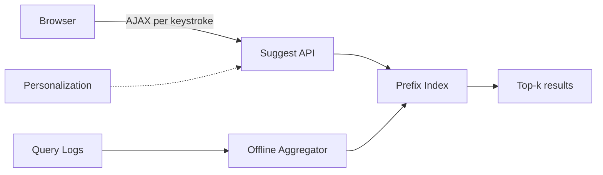
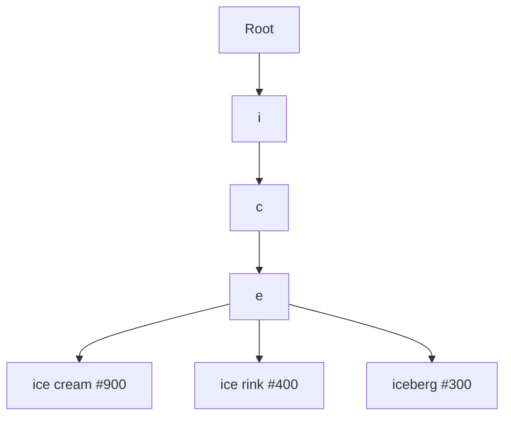
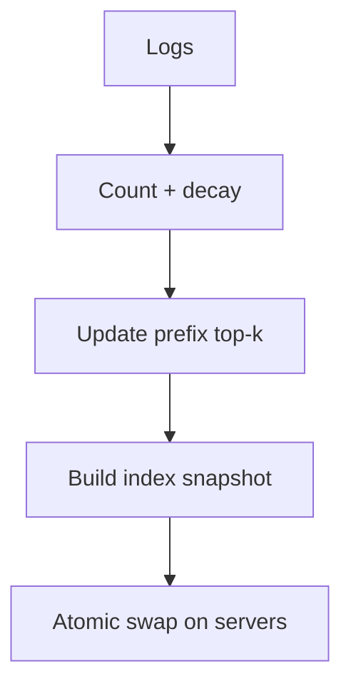

# Search Autocomplete

## The simple idea

Autocomplete (typeahead) suggests complete search queries as you type `"ice"` → `"ice cream"`, `"ice rink"`, … Results must appear in a few dozen milliseconds or the feature feels broken.

## Why it matters

This problem mixes a classic data structure (**prefix trees**), **top-k ranking**, and a **latency budget** that is tighter than most APIs. It also shows how offline analytics feed an online serving path.

## Clarify (requirements + rough numbers)

- **Input:** prefix string (Unicode? case folding? typos?)
- **Output:** top 5–10 queries by popularity (or personalized score).
- **Latency:** ideally < 100 ms end-to-end; often < 50 ms for the suggestion API alone.
- **Freshness:** new viral queries should appear within minutes to hours, not weeks.
- **Scale sketch:** 10k+ suggestion QPS at peak; query log volume much higher. Dictionary of millions of phrases is common.

## High-level design

Online path is tiny and cache-friendly. Offline workers rebuild or patch the index from real searches.

## Deep dive

### 1. Trie / prefix index

A **trie** stores characters along edges. Each node can hold (or point to) the best queries under that prefix.

At serving time: walk the prefix → read precomputed top-k → return.

**Alternatives:** sorted list / segmented DB with `WHERE query LIKE 'ice%'` (too slow alone), or inverted suffix structures. Tries (or radix/patricia trees) are the usual interview answer. For huge datasets, shard by first character(s) across servers.

### 2. Gathering queries and computing top-k

Source of truth: **search query logs** (successful searches, not every aborted keystroke).

Offline pipeline (hourly / near-real-time stream):

1. Normalize: lowercase, trim, maybe Unicode NFKC.
2. Count frequency over a time window (day / week) with decay so yesterday's spike fades.
3. For each prefix of interest, keep a heap / bounded list of top queries.
4. Publish a new index snapshot; serve until the next one.

Limit prefix depth (e.g. only materialize after 2 characters) to control memory.

### 3. AJAX latency tricks

Every keystroke can fire a request — that is dangerous.

- **Debounce** on the client (150–200 ms after typing pauses).
- **Cancel** in-flight requests when a newer prefix is typed.
- Cache recent prefixes in the browser and at the CDN / API edge.
- Cap prefix length and reject empty / whitespace-only.
- Use a compact response schema (list of strings + optional scores).

Backend: keep the trie in memory; no disk hop on the suggest path.

### 4. Refresh workers and light personalization

**Offline / async workers** continuously:

- Recompute frequencies from logs / streams.
- Filter spam, adult content, injection attempts.
- Deploy snapshots atomically (two-version swap).

**Personalization (brief):** boost queries the user clicked before, or local/language preferences. Keep a small user profile cache and re-rank the global top-k — do not build a full personal trie per user in the interview design. Safety: never leak another user's private searches.

If personalization is unavailable, the global top-k list alone is still a solid MVP.

## Key trade-offs

- **Memory-heavy trie vs slower disk-backed search:** latency wins for autocomplete.
- **Global popularity vs personalized ranking:** simplicity vs relevance.
- **Frequent rebuilds vs streaming updates:** ops complexity vs freshness.
- **More suggestions vs cleaner UX:** diminishing returns after ~8–10.

## Remember

- Serve from an in-memory prefix index with precomputed top-k.
- Build that index offline from query frequencies.
- Protect latency with debouncing, caching, and tiny payloads.
- Refresh with atomic snapshots; personalize only as a light re-rank.
- Cap when suggestions start (min prefix length) to save work.
