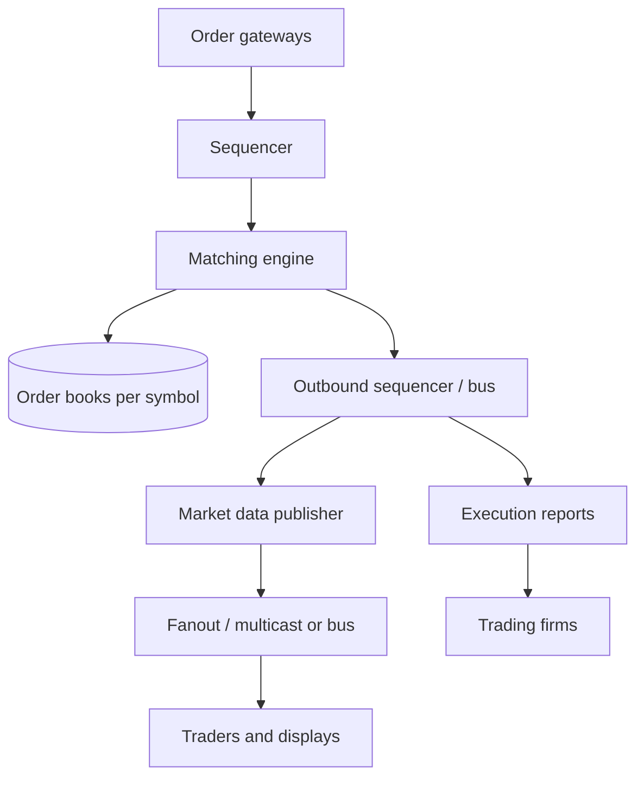
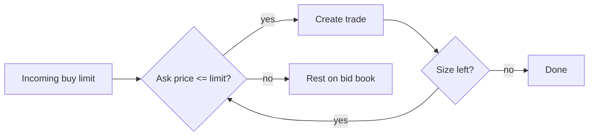
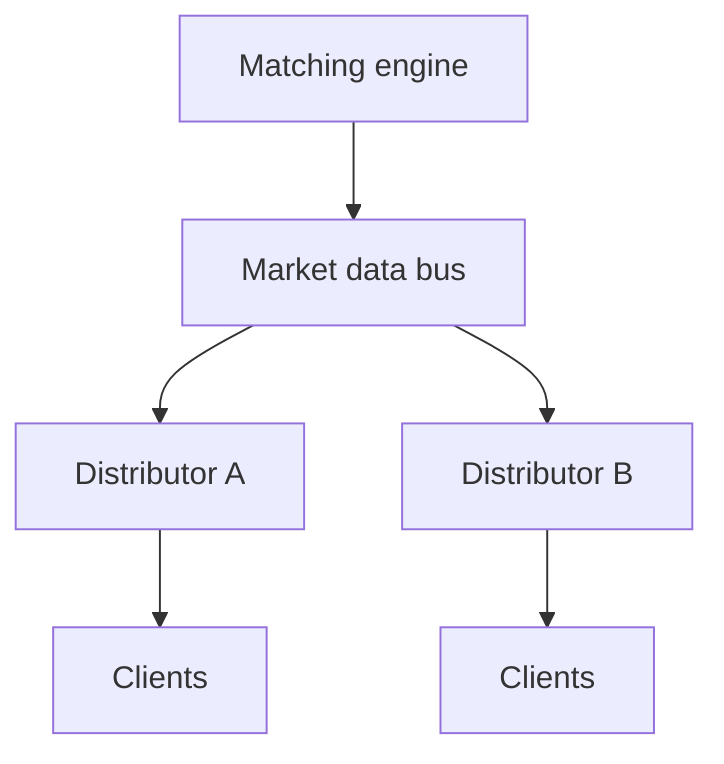

# Stock Exchange

## The simple idea

Traders send **orders**. A **matching engine** pairs buys and sells using an **order book**. A **sequencer** decides a single fair order of events. **Market data** fans out trades and book updates to everyone watching. Speed matters — but fairness matters more.

## Why it matters

Exchanges are a classic low-latency design problem: deterministic matching, strict ordering, and broadcasting results without letting some clients "see the future" before others in unfair ways.

## Clarify

- Asset types: equities, crypto, derivatives?
- Order types needed on day one (limit + market may be enough)?
- Continuous trading only, or auctions too?
- Latency targets (microseconds vs milliseconds)?
- How many symbols? Peak orders/sec?
- Who needs market data: retail apps, pros, internal risk?

APIs (conceptual):

- `NEW_ORDER` / `CANCEL` / `REPLACE`
- Execution reports back to the trading firm
- Market data streams: trades, top-of-book, depth

## High-level design

## Deep dive

### Order types (brief)

| Type | Meaning |
| --- | --- |
| Limit | Buy/sell at this price or better; rests on the book if not filled |
| Market | Take whatever liquidity is available now (slippage risk) |
| IOC / FOK | Immediate-or-cancel / fill-or-kill variants of urgency |
| Stop | Becomes live when a trigger price trades (optional later) |

Start with limit + cancel. Add complexity only when product needs it.

### Order book and matching

Per symbol, keep:

- **Bids** (buys) sorted best price first (highest), then time
- **Asks** (sells) sorted best price first (lowest), then time

Matching rules (typical price-time priority):

1. Incoming buy limit at price P matches the lowest asks with price ≤ P.
2. Fill as much as size allows; reduce resting order size.
3. If remainder can rest, add it to the bid side with a timestamp.
4. Emit trades + book deltas.

Keep matching **single-threaded per symbol** (or per shard of symbols). That is how you get deterministic results without lock chaos.

### Sequencer

Many gateways accept orders. Without a global order, two engines could disagree.

A **sequencer** assigns a monotonic sequence number to each accepted input (new, cancel, replace). The matching engine applies inputs **strictly in sequence order**. Replay from a log becomes possible: same inputs → same trades.

Persistence: write the sequenced input log durably (often before or in lockstep with matching, depending on latency design). On crash, rebuild books by replaying.

### Market data fanout

After each event, publish:

- Trade messages (price, size, symbol, time)
- Book updates (add/modify/delete levels)
- Optionally snapshots for late joiners

Fanout tips:

- Separate **trading path** (execution reports to the firm) from **public market data**
- Use a bus, multicast, or tiered distributors so the matching engine never waits on slow clients
- Snapshot + incremental channels help new subscribers catch up

### Latency and fairness

**Latency**: colocated gateways, minimal allocations in the hot path, in-memory books, careful syscalls, sometimes hardware-friendly designs. Measure p99/p999, not just averages.

**Fairness**:

- Same rules for everyone: price-time priority applied deterministically
- Do not leak the next trade to a favored feed before others on the same channel tier
- Gateways may still have geographic latency differences — that is physics; the engine must not add arbitrary favoritism
- Cancels and news races are real; clear timestamping and sequencing keep the story auditable

Risk and controls (high level): pre-trade checks (notional limits), kill switches, and throttles at the gateway so one faulty firm cannot melt the book.

## Key trade-offs

| Choice | Upside | Downside |
| --- | --- | --- |
| Single thread per symbol | Deterministic, fast | Scale by sharding symbols |
| Central sequencer | Total order, replay | Sequencer becomes critical path |
| Deep market data | Better trader UX | More bandwidth and fanout cost |
| Sync disk every event | Strong durability | Adds latency |
| Async acknowledge | Lower latency | Harder crash semantics |

## Remember

- Matching is deterministic: sequenced inputs into an in-memory book per symbol.
- Separate the hot matching path from market data fanout to slow consumers.
- Optimize latency, but design fairness and replayability first — speed without a clear order of events is just a race.
