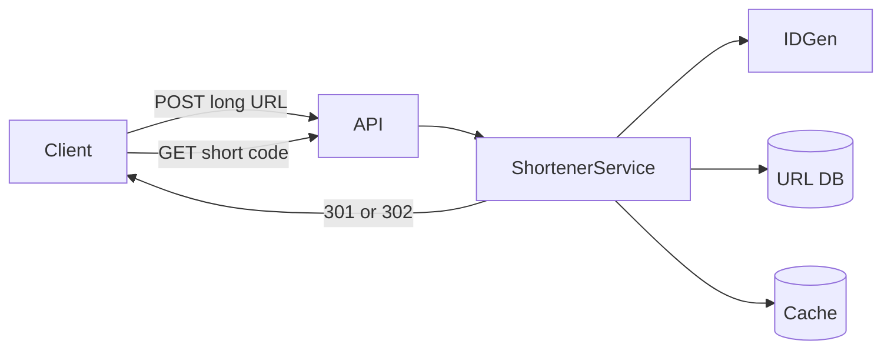
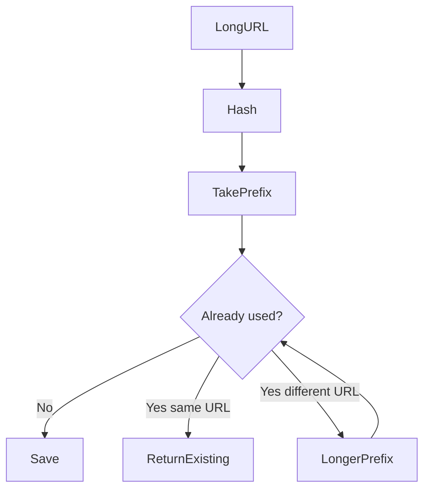
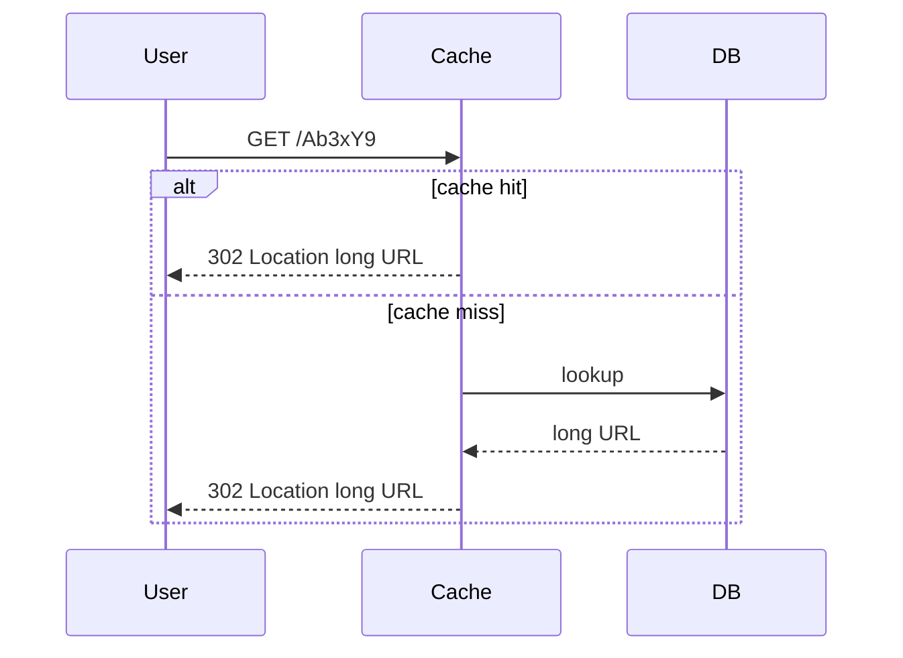

# URL Shortener

## The simple idea

A URL shortener turns a long web address into a tiny one. When someone opens the short link, your service looks up the real URL and sends them there. Think of it as a giant phone book: short code → long URL.

## Why it matters

Short links fit in texts, tweets, and QR codes. They also let you track clicks and change the destination later. In interviews, this problem is a gentle intro to APIs, encoding, caching, and scale math.

## Clarify (requirements + rough numbers)

Ask before you draw boxes:

- **Functional:** create short URL, redirect, optional custom alias, optional expiry / analytics.
- **Non-functional:** redirect must be fast (low latency), mappings must not get lost, system should grow to billions of URLs.
- **Rough numbers (example):** 100M new URLs/month → ~40 writes/sec average. Reads are often 10–100× writes. Average long URL ~500 bytes. Five years of data can be tens of terabytes if you keep lots of metadata — say ~5–20 TB for mappings alone depending on retention.

Write down write QPS, read QPS, and storage. Interviewers care that you estimate, not that the number is perfect.

## High-level design

**Core APIs**

- `POST /api/v1/urls` — body: `{ "longUrl": "..." }` → `{ "shortUrl": "https://tiny.example/Ab3xY9" }`
- `GET /:code` — look up and redirect

Keep create and redirect on the same service at first. Split later if traffic demands it.

## Deep dive

### 1. 301 vs 302 redirects

| Redirect | Meaning | Browser caching | When to use |
| --- | --- | --- | --- |
| **301** | Permanent | Often caches the mapping | Destination never changes; saves your servers |
| **302** | Temporary | Usually rechecks your service | You need click analytics or may change the target |

If you need every click logged, prefer **302**. If the link is permanent and analytics are optional, **301** reduces load. Say this trade-off out loud in the interview.

### 2. How to make the short code: base62 vs hash

**Option A — counter + base62**

1. Get a unique integer ID (DB auto-increment, ticket server, or Snowflake-style ID).
2. Encode it in base62 (`0-9a-zA-Z`) so the string is short.

Example: ID `125` → base62 might look like `21`.

Pros: short, no collisions if IDs are unique. Cons: you need a reliable ID generator; sequential IDs can leak growth rates (sometimes acceptable).

**Option B — hash the long URL**

Hash with MD5/SHA, take first N characters.

Pros: same long URL → same short code (idempotent). Cons: **collisions**. You must check the DB and lengthen or rehash on conflict.

For most interview answers, **base62 of a unique ID** is cleaner. Mention hash as an alternative.

### 3. Data model

Keep the table tiny:

| Column | Type | Notes |
| --- | --- | --- |
| `id` | bigint | Primary key / source of short code |
| `short_code` | varchar(10) | Unique index; optional if derived from id |
| `long_url` | text | The destination |
| `created_at` | timestamp | |
| `expires_at` | timestamp | Nullable |
| `user_id` | bigint | Nullable for anonymous creates |

Redirect path: cache → DB → 404 if missing / expired.

### 4. Estimation, cache, and scale

- **Cache** hot short codes in Redis (or similar). Redirects follow a power-law: a few links get most traffic.
- **DB** can start as a single SQL table; shard by short code or ID range when storage or write QPS grows.
- **CDN** in front of redirects helps for global latency, but caching must respect 301 vs 302.
- **Rate limit** create API so scrapers cannot fill your DB.

## Key trade-offs

- **301 vs 302:** lower server load vs accurate click counts.
- **Base62 ID vs hash:** no collisions vs natural dedupe of identical URLs.
- **SQL vs NoSQL:** simple joins/transactions vs easier horizontal growth for a flat key-value mapping.
- **Custom aliases:** nicer UX, but uniqueness checks and abuse (squatting) become real work.

## Remember

- APIs are create + redirect; everything else is optional.
- Encode a unique ID in base62 for short codes; mention hash+collision handling as a peer approach.
- Choose 301/302 based on analytics needs.
- Cache redirects; estimate storage and QPS early.
- Scale by caching first, then sharding the mapping store.
