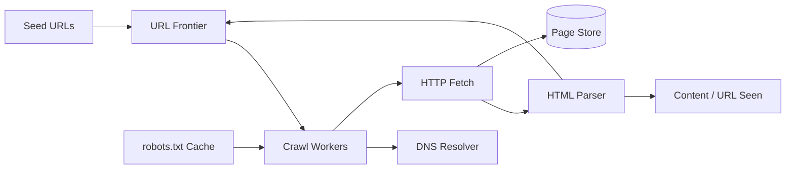
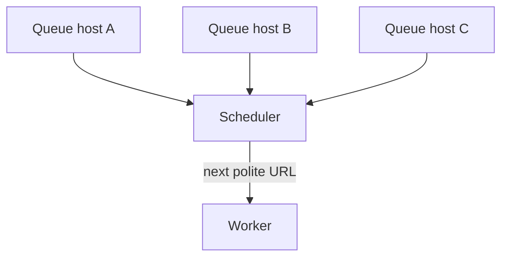
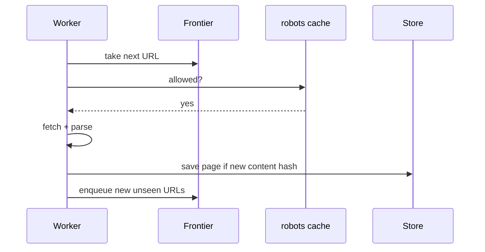

# Web Crawler

## The simple idea

A web crawler is a robot that starts from a few seed URLs, downloads pages, extracts new links, and repeats. Search engines, price trackers, and research tools all depend on this loop.

## Why it matters

The hard part is not downloading one page — it is downloading **billions** of pages without angering websites, without getting stuck in loops, and without drowning your own cluster in work.

## Clarify (requirements + rough numbers)

- **Goals:** which pages? HTML only? images? how fresh must data be?
- **Constraints:** respect `robots.txt`, per-host rate limits, max depth, legal/ToS boundaries.
- **Scale sketch:** 1B pages, average page 100 KB → ~100 TB raw. If you want a full refresh monthly, you need tens of thousands of pages/sec sustained — so parallelism and prioritization matter.
- **Output:** raw HTML store? extracted text? link graph for ranking?

## High-level design

Workers pull URLs from the frontier, check politeness rules, fetch, parse, store, and push new URLs back.

## Deep dive

### 1. Seed URLs and the URL frontier

**Seeds** are the starting set: homepage lists, sitemaps, or a previous crawl's top domains.

The **URL frontier** is the queue of URLs waiting to be crawled. A naive single FIFO queue fails at scale because:

- One huge site can monopolize workers.
- You need per-host delays (politeness).
- You want to prioritize important or fresh pages.

A practical frontier:

- Many queues keyed by host (or crawl group).
- A scheduler picks the next host that is "due" for a fetch.
- Priorities: new sites, frequently changing pages, high PageRank, etc.

### 2. Politeness and robots.txt

**Politeness** means: do not hammer one server. Typical rules:

- Max N concurrent connections per host (often 1–2 for polite crawlers).
- Minimum delay between requests to the same host.
- Honor `Crawl-Delay` when present.

**robots.txt** tells crawlers which paths are allowed. Cache it per host (refresh periodically). Skip disallowed URLs early so they never enter the expensive fetch path.

Also normalize URLs before enqueue: lowercase host, strip fragments (`#...`), resolve relative links, optional trailing-slash rules. Normalization prevents the same page from being crawled as ten different strings.

### 3. DFS vs BFS (and why BFS usually wins)

| Strategy | Behavior | Risk |
| --- | --- | --- |
| **DFS** | Follow deep into one site | Can get stuck in one domain; uneven coverage |
| **BFS** | Explore broadly by hop distance from seeds | Fairer discovery of many sites |

Production crawlers are rarely pure DFS or BFS. They use **priority queues** with BFS-like breadth plus scores (importance, change rate). For interviews, say: *start with BFS for coverage; add priorities for quality.*

### 4. Parsers, "seen" checks, and scaling workers

**Parser:** extract links (`<a href>`), canonical URL, maybe title/text. Be careful with malformed HTML — use a forgiving parser.

**URL-seen:** bloom filter or key-value store so you do not enqueue the same URL forever.

**Content-seen:** hash page body (or main text). If two URLs return the same content, skip storing duplicates (mirrors, session IDs).

**Scale workers horizontally:** frontier and seen-store become the shared bottleneck. Shard the frontier by host hash so one host always maps to one queue owner. Separate DNS caching — DNS can become a surprising hotspot.

## Key trade-offs

- **Coverage vs freshness:** crawl more sites shallowly, or recrawl important sites often.
- **Politeness vs throughput:** slower per host, more hosts in parallel.
- **Exact dedupe vs bloom filters:** memory vs small false-positive skip rate.
- **BFS vs priority crawl:** simplicity vs better index quality.

## Remember

- Loop: frontier → polite fetch → parse → store → enqueue new links.
- Respect robots.txt and per-host rate limits.
- Prefer BFS-style / priority scheduling over deep DFS.
- Deduplicate both URLs and content.
- Scale by sharding the frontier by host and growing workers independently.
