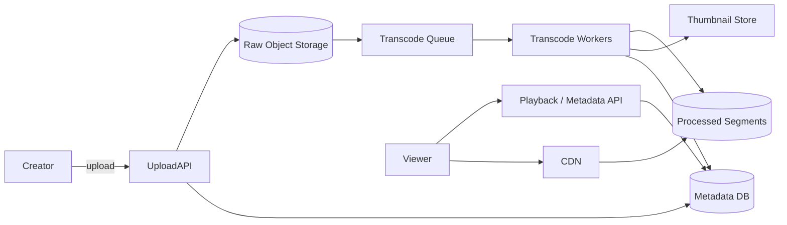
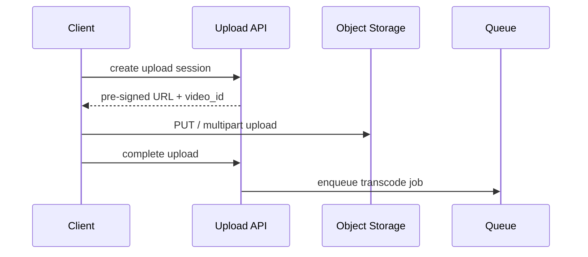
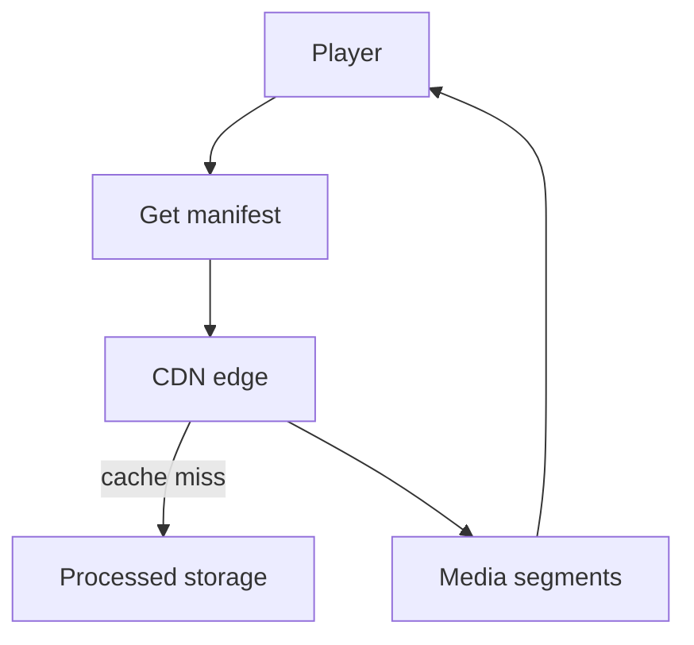

# YouTube-like Video Platform

## The simple idea

Users upload videos; everyone else watches them smoothly on any device. That means **store once**, **transcode into many qualities**, **push bytes through a CDN**, and keep **metadata** searchable and fast.

## Why it matters

Video is huge — bandwidth and storage dominate cost. A good design separates the control plane (metadata, uploads, processing) from the data plane (chunked media delivery).

## Clarify (requirements + rough numbers)

- **Features:** upload, process, play, thumbnails, comments/likes (often out of scope), recommendations (mention only).
- **Formats:** adaptive bitrate (HLS/DASH) with several resolutions.
- **Scale sketch:** 500 hours uploaded per minute is a famous order-of-magnitude for large platforms — even a toy target like 1% of that is still heavy. Watch traffic dwarfs upload traffic.
- **Latency:** upload can take minutes; **time-to-first-frame** on play should be low thanks to CDN edge caches.

## High-level design

Upload and watch paths share metadata; bytes flow through storage and CDN.

## Deep dive

### 1. Upload path

1. Client asks for an upload session (auth, max size, content type).
2. Client uploads **directly to object storage** with a pre-signed URL (or chunked multipart upload for large files).
3. Upload service records `video_id`, owner, title, state=`uploaded`.
4. A message lands on the **transcode queue**.

Avoid streaming multi-GB files through your app servers — they are the wrong hop.

### 2. Transcoding pipeline

Workers pull jobs and produce multiple renditions (e.g. 360p, 720p, 1080p) plus segmented files for adaptive streaming.

- CPU/GPU heavy — autoscale workers on queue depth.
- Idempotent jobs: retries must not corrupt output.
- Update metadata: state=`processing` → `ready` (or `failed`).
- Generate **thumbnails** (and maybe preview gifs) in the same pipeline.

Store outputs in a separate bucket/prefix from raw originals. Keep the original for re-transcoding when you add new formats later.

### 3. Storage, CDN streaming, metadata

**Storage:** object store for raw + processed media. Hot videos get edge-cached; cold videos stay in origin / cheaper tiers.

**CDN / streaming:** player requests a manifest (HLS/DASH). Manifest lists segment URLs on the CDN. Player switches bitrate as network changes.

**Metadata DB:** `video_id`, title, description, duration, owner, visibility, processing state, thumbnail URLs, playback URLs. Use a cache in front for popular videos. Comments and reactions belong in separate services.

### 4. Scaling hot videos

A viral video creates a **read storm** on metadata and origin storage.

- Cache metadata aggressively with short TTL for views counters (eventual is fine).
- CDN should absorb almost all segment traffic — tune TTLs and prefetch popular manifests.
- Protect origin with rate limits and regional replicas of storage.
- Separate **view counting** into an async pipeline so play API stays snappy.
- For live streaming (optional mention), use a different ingest path (RTMP/WebRTC → packager → CDN) rather than forcing VOD upload flow.

## Key trade-offs

- **Many renditions vs cost:** better playback vs more storage/CPU.
- **Pre-signed direct upload vs proxy upload:** scalability vs easier validation inline.
- **Eventual view counts vs exact counts:** performance vs precision.
- **Re-transcode from original vs discard original:** flexibility vs storage bill.

## Remember

- Direct-to-storage upload, then async transcode.
- Adaptive bitrate + CDN is the playback backbone.
- Metadata is a small DB/cache problem; media is an object-storage problem.
- Hot videos are won or lost at the CDN edge.
- Keep processing idempotent and status visible to the creator.
