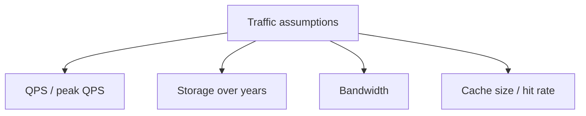

# Back-of-the-Envelope Estimation

## The simple idea

Before drawing boxes, do rough math. Good estimates tell you whether you need one database or one hundred.

## Why it matters

Interviewers care that you can size a system. Rough numbers (powers of 10) are enough — perfection is not the goal.

## Numbers worth memorizing

| Thing | Approx value |
| --- | --- |
| 1 byte | a character |
| 1 KB | a short paragraph / small JSON |
| 1 MB | a photo thumbnail or short audio |
| 1 GB | a large DB chunk / lightly compressed video |
| Latency in same datacenter | ~0.5 ms |
| Disk seek | ~10 ms |
| Read 1 MB from memory | ~0.25 ms |
| Read 1 MB from SSD | ~1 ms |
| Read 1 MB from network | ~10 ms |

Rule of thumb: **memory ≫ SSD ≫ network ≫ spinning disk**.

## What to estimate

### QPS (queries per second)
If 100 million daily active users each do 10 reads/day:
- Reads/day = 1 billion
- Average QPS ≈ 1e9 / 86400 ≈ **12,000 QPS**
- Peak is often **2–5×** average

### Storage
100M users × 1 KB profile ≈ 100 GB. Add indexes, replicas, and growth (often 2–3×).

### Bandwidth
12,000 QPS × 2 KB response ≈ 24 MB/s ≈ **~200 Mbps**. Easy for modern links — but check video or image paths carefully.

## A tiny worked example

Design a photo share with 50M users, 20% daily active, each uploads 1 photo/day (200 KB), and reads 10 photos/day.

1. **Writes/day** = 50M × 0.2 × 1 = 10M uploads → ~115 write QPS
2. **Reads/day** = 50M × 0.2 × 10 = 100M → ~1,160 read QPS
3. **New storage/day** = 10M × 200 KB ≈ 2 TB/day
4. **Yearly storage** ≈ 730 TB (+ replicas)

These numbers already hint: object storage for photos, CDN for reads, metadata DB separate from blobs.

## Tips that keep you honest

- Round aggressively (use 10^x).
- State assumptions out loud.
- Revisit estimates after the high-level design.
- Estimate **peak**, not only average.

## Remember

Estimation is a compass, not a calculator. It steers architecture choices early.
