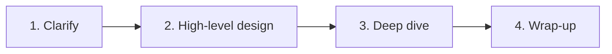

# System Design Interview Framework

## The simple idea

Treat every design like a conversation with four chapters: clarify, sketch, deepen, wrap up. Structure beats panic.

## The 4 steps

### Step 1 — Clarify requirements (5–10 min)
Ask about:
- **Functional**: what must the system do?
- **Non-functional**: scale, latency, consistency, availability
- **Out of scope**: mobile offline? multi-region on day one?

Example prompts:
- How many daily active users?
- Read/write ratio?
- Strong consistency needed, or is eventual OK?

Write the agreed scope on the board.

### Step 2 — High-level design (10–15 min)
Draw the big boxes and data flow first:
- Clients → API / gateway → services → storage
- Add CDN, cache, queue only when needed

Define core APIs early (`POST /tweets`, `GET /feed`). APIs force clarity.

### Step 3 — Deep dive (10–20 min)
Pick 2–3 hard parts and go deep:
- Data model / schema
- Bottleneck (hot keys, fan-out, uploads)
- Consistency and failure handling

Do not deep-dive everything. Signal judgment by choosing the interesting risks.

### Step 4 — Wrap-up (5 min)
- Summarize the design
- Call out bottlenecks and next scale steps
- Mention monitoring, security, and rough numbers briefly

## Communication tips

| Do | Don't |
| --- | --- |
| Think out loud | Stay silent for long stretches |
| Drive with a plan | Jump into schema in minute one |
| Use diagrams | Dump buzzwords without links |
| Trade-offs > perfect answers | Pretend there is one right design |

## A reusable checklist

1. Users & scale
2. APIs
3. Data model
4. High-level diagram
5. Bottlenecks
6. Failure modes
7. Next evolution

## Remember

Interviewers score clarity and trade-off thinking more than memorized architecture diagrams.
