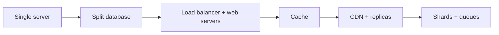
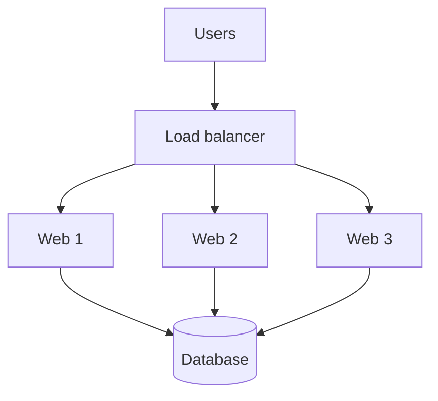

# Scale From Zero to Millions

## The simple idea

Start with one server. When it gets busy, split work into layers and add more machines. Scaling is not one big jump — it is a series of small, clear upgrades.

## Why it matters

Every large system began small. If you understand the journey, you can design for growth without overbuilding on day one.

## Path from 1 user to millions

## Step by step

### 1. One box for everything
Web app, database, and files all live on one machine. Fine for a prototype. DNS points a domain to that server's IP.

### 2. Move the database out
When CPU and disk fight each other, put the database on its own server. Now web and data scale independently.

### 3. Vertical vs horizontal scaling
- **Vertical**: bigger CPU/RAM on the same machine. Simple, but has a hard ceiling and a single point of failure.
- **Horizontal**: more machines behind a load balancer. This is how you grow past one box.

### 4. Load balancer
Traffic lands on the load balancer, which spreads requests across healthy web servers. If one dies, others keep serving.

### 5. Database replication
Use a **primary** for writes and **replicas** for reads. Most apps read far more than they write, so replicas buy a lot of capacity.

### 6. Cache
Put hot data in Redis/Memcached in front of the database. Cache miss → read DB → fill cache. Watch for stale data and stampedes.

### 7. CDN
Static images, CSS, and videos should come from edge servers close to users. Your origin stays free for dynamic work.

### 8. Stateless web tier
Do not store session state only in one web server's memory. Keep sessions in a shared store so any server can handle any request.

### 9. More data tricks
When one database is not enough:
- **Sharding** — split data by user id or key range
- **Message queues** — move slow work off the request path
- **Multiple services** — split by domain when a monolith becomes hard to change

## Key trade-offs

| Choice | Upside | Downside |
| --- | --- | --- |
| Vertical scale | Simple ops | Hardware limit, downtime risk |
| Horizontal scale | Near unlimited growth | More moving parts |
| Cache | Fast reads | Invalidation complexity |
| Sharding | Huge data capacity | Cross-shard queries are hard |

## Remember

- Scale one bottleneck at a time.
- Prefer simple designs until metrics force complexity.
- Stateless services + cache + replicas cover most early growth.
